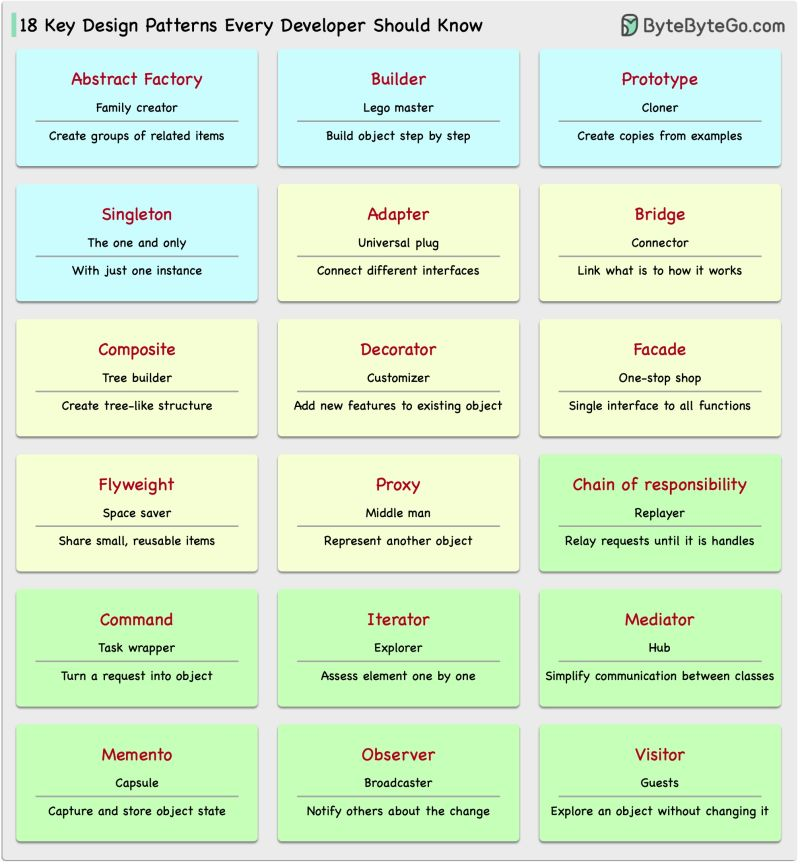
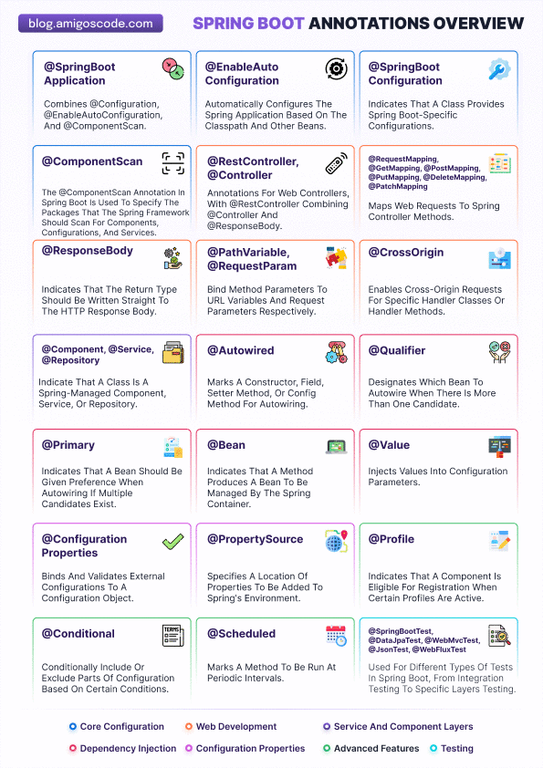
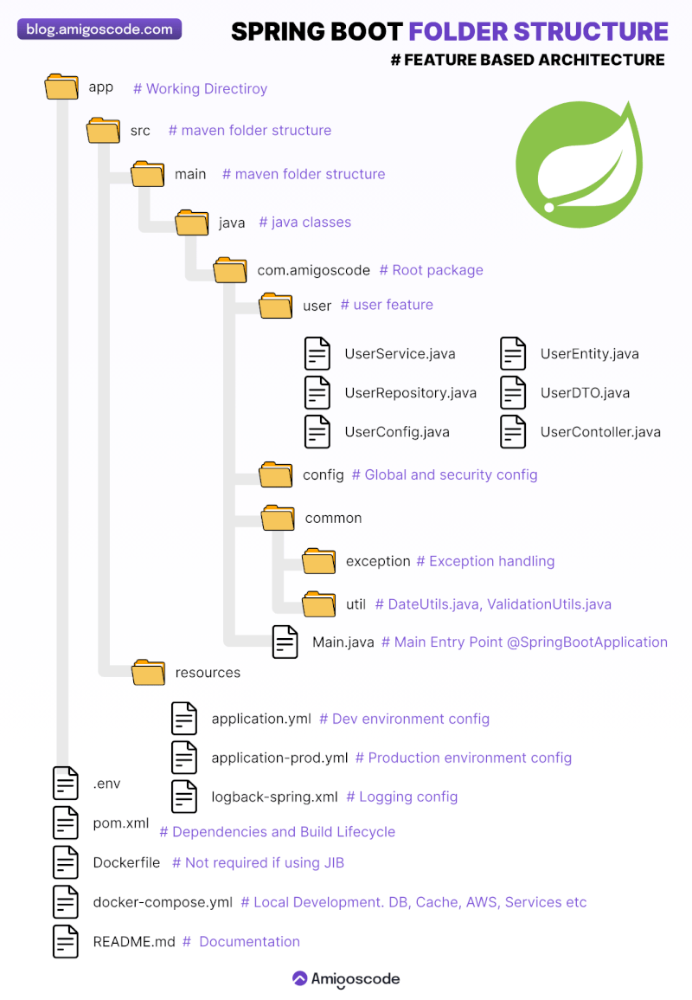

5️⃣ What is the difference between == and .equals() in Java?
6️⃣ Explain Exception Handling and the difference between Checked and Unchecked Exceptions.
7️⃣ What is Multithreading and how does Java handle concurrency?
8️⃣ What is the difference between abstract classes and interfaces?
9️⃣ What is the purpose of the final, finally, and finalize()?
10️⃣ How does Garbage Collection work in Java?
11 18 Design patterns
18 Key Design Patterns Every Developer Should Know

Patterns are reusable solutions to common design problems, resulting in a smoother, more efficient development process. They serve as blueprints for building better software structures. These are some of the most popular patterns:

- Abstract Factory: Family Creator - Makes groups of related items.
- Builder: Lego Master - Builds objects step by step, keeping creation and appearance
- Prototype: Clone Maker - Creates copies of fully prepared examples.
- Singleton: One and Only - A special class with just one instance.
- Adapter: Universal Plug - Connects things with different interfaces.
- Bridge: Function Connector - Links how an object works to what it does.
- Composite: Tree Builder - Forms tree-like structures of simple and complex parts.
- Decorator: Customizer - Adds features to objects without changing their core.
- Facade: One-Stop-Shop - Represents a whole system with a single, simplified interface.
- Flyweight: Space Saver - Shares small, reusable items efficiently.
- Proxy: Stand-In Actor - Represents another object, controlling access or actions.
- Chain of Responsibility: Request Relay - Passes a request through a chain of objects until handled.
- Command: Task Wrapper - Turns a request into an object, ready for action.
- Iterator: Collection Explorer - Accesses elements in a collection one by one.
- Mediator: Communication Hub - Simplifies interactions between different classes.
- Memento: Time Capsule - Captures and restores an object's state.
- Observer: News Broadcaster - Notifies classes about changes in other objects.
- Visitor: Skillful Guest - Adds new operations to a class without altering it.

If you're short on time and busy preparing for your next Java Spring Boot Interview..

Then I will recommend you to spend just 3-4 hours to watch these essential videos. They'll cover 70-80% of the core topics you'll need and help you get prepped for your interview:

1) Top 10 Essential Spring Boot Interview Concepts | Must-Know Topics for every Spring Boot Developer: https://linktw.in/hmooIN

2) 10 Essential Spring Boot Scenario-Based Interview Questions: https://linktw.in/sPhpxK

3) Top 10 Essential Spring Boot Annotations for Interviews: https://linktw.in/GoMzdV

4) Java Multithreading Crash Course:
https://linktw.in/kLDryG

5) Java Streams in Depth (imp):
https://linktw.in/LrgfYU

6) JWT Authentication in Spring Boot and MongoDB:
https://linktw.in/fpqHSA

7) Achieving zero downtime:
https://linktw.in/OtzFFq

8) System Design masterclass:
https://linktw.in/UWROqql

9) Implement caching in Spring Boot:
https://linktw.in/sOqjDB

Above resources will help you to revise important concepts which are much needed in Interviews.

Spring Boot Annotations You Must Know to Level Up Your Spring Boot Skills 👇

Let's dive into the key Spring Boot annotations every developer should know to build powerful, efficient applications. Here's your cheat sheet:

📌 @SpringBootApplication: Combines @Configuration, @EnableAutoConfiguration, and @ComponentScan to configure and initialize the Spring application context automatically.

📌 @EnableAutoConfiguration: Automatically configures the Spring app based on the classpath, available beans, and other configurations.

📌 @SpringBootConfiguration: Declares that a class contains Spring Boot-specific configurations.

📌 @ComponentScan: Directs Spring to scan specific packages for components, configurations, and services.

📌 @RestController & @Controller: Used to handle web requests by mapping them to their corresponding handler methods.

📌 @ResponseBody: Directs that the return type should be written straight to the HTTP response body, typically in REST APIs.

📌 @PathVariable & @RequestParam: Maps method parameters to URL variables and request parameters, respectively, allowing dynamic handling of requests.

📌 @Component, @Service, @Repository: Mark classes as Spring-managed components for dependency injection.

📌 @Autowired: Automatically injects dependencies into constructors, fields, setters, or methods.

📌 @Qualifier: Resolves conflicts when multiple beans of the same type are present by specifying which one to inject.

📌 @Primary: Marks a bean as the primary candidate for autowiring when multiple options are available.

📌 @Bean: Defines a method that returns a Spring-managed bean.

📌 @ConfigurationProperties: Binds external configurations (like properties files) to a configuration object.

📌 @Conditional: Conditionally includes or excludes configuration parts based on specific conditions.

📌 @Scheduled: Triggers a method to run at predefined intervals for scheduled tasks.

📌 @Value: Injects values from external sources into configuration parameters.

📌 @PropertySource: Adds properties from external sources to Spring's environment.

📌 @Profile: Activates components only when specific application profiles (like "dev" or "prod") are active.

📌 Testing Annotations:

@SpringBootTest: Used for running Spring Boot integration tests.
@DataJpaTest: Tests JPA repositories.
@WebMvcTest: Focuses on testing the web layer.

Mastering these Spring Boot annotations will make your development process smoother, faster, and more efficient. Know any other must-use annotations? Share your thoughts below! 

Struggling with Java 8 Interviews? Stick This PDF on Your Wall!

Java 8 changed the game, and interviewers love testing candidates on its key features.
Yet, many developers struggle with these must-know topics:

✅ Lambda Expressions – Writing cleaner, more concise code
✅ Functional Interfaces – Understanding Predicate, Consumer, Supplier, and Function
✅ Streams API – Efficient data processing with map(), filter(), and reduce()
✅ Method References – Simplifying lambda expressions further
✅ Default & Static Methods in Interfaces – Adding functionality without breaking existing code
✅ Optional Class – Handling null safely
✅ Date & Time API – Replacing the old Date class with LocalDate, LocalTime, and Instant

🚨 𝗗𝗼𝗻'𝘁 𝗳𝗼𝗿𝗴𝗲𝘁 𝘁𝗼 𝗿𝗲𝘃𝗶𝘀𝗲 𝘁𝗵𝗲 𝗯𝗲𝗹𝗼𝘄 𝗦𝗽𝗿𝗶𝗻𝗴 𝗕𝗼𝗼𝘁 𝗾𝘂𝗲𝘀𝘁𝗶𝗼𝗻𝘀 𝗯𝗲𝗳𝗼𝗿𝗲 𝘆𝗼𝘂𝗿 𝗻𝗲𝘅𝘁 𝗶𝗻𝘁𝗲𝗿𝘃𝗶𝗲𝘄.
..
• Difference between @Primary and @Qualifier annotation, when to use which?
• Difference between @Controller and @Component, can we use them interchangeably?
• Difference between BeanFactory and application context?
• What Are DispatcherServlet and ContextLoaderListener
• What are Spring MVC interceptors?
• What Is an Init Binder?
• Can you create a controller without using @Controller or @RestController annotations?
• In spring by default beans are singleton, it means they are thread safe by default?
• How is the root application context in Spring MVC loaded?
• Limitation of @Autowired annotation ? 
• How @SpringBootApplication annotation work?
• Name the exceptions thrown by the Spring DAO classes.
• What do you mean by Aspect?
• What is an Advice?
• What are the different types of Advices?
• What are the different AOP implementations?
• What do you mean by Proxy in Spring Framework?
• Explain Spring bean lifecycle ?
• What is Spring MVC and Spring ?
• Explain Dispatcher servlet in detail ?
• How to implement Custom validator other than predefined?

1️⃣ What are the four pillars of Object-Oriented Programming? 🏛️
2️⃣ What is the difference between an abstract class and an interface? 🆚
3️⃣ Explain method overloading vs. method overriding. 🔄
4️⃣ What is encapsulation? How does Java achieve it? 🔐
5️⃣ How does Java support multiple inheritance? 🔗
6️⃣ What is polymorphism? Give an example. 🎭
7️⃣ What is the use of this and super in Java? 🏷️
8️⃣ Can a constructor be private? Why or why not? 🚪
9️⃣ What is the significance of final keyword in OOP? 🔥
🔟 How does Java achieve runtime polymorphism? ⚡

Everything Spring Boot Developers Should Know About Feature‑Based Architecture 👇

Organizing your Spring Boot projects by feature makes them easier to manage and grow. But how does this approach work? 

Let’s break it down ⬇️

[1.] Feature‑Centric Packages
◾ Group related code under feature names (e.g., `user`, `config`, `common`).
◾ Enforce module boundaries for clearer ownership and easier navigation.

[2.] Separation of Concerns
◾Service – Encapsulates business logic.
◾ Repository – Handles data persistence.
◾ DTO – Defines data transfer shapes.
◾ Entity – Maps to database tables.
◾ Controller – Exposes REST endpoints.

[3.] Shared Infrastructure
◾ Global Configs – Centralizes application properties.
◾ Exception Handling – Standardizes error responses.
◾ Utilities – Houses reusable helpers and validators.

[4.] Environment‑Specific Setup
◾ Dev vs. Prod Profiles – Activates the correct settings for each environment.
◾ Docker Support – Builds container images with JIB and Dockerfiles.
◾ Local Development – Orchestrates services via `docker‑compose.yml`.

[5.] Maven‑Standard Structure
◾ Follows `src/main/java` and `src/main/resources` conventions.
◾ Aligns with Spring Boot best practices for immediate familiarity.

💡 Why This Matters
◾ Readability – Locate code by feature, not by layer.
◾ Scalability – Add features without bloating core packages.
◾ Maintainability – Isolate changes to specific modules.
◾ Onboarding – New team members ramp up faster when the structure is predictable.

🔍 Interview Questions - ✅ Difference between @Component, @Service, @Repository, and @Controller.

All of these are Spring stereotypes used to create beans and manage them with Spring’s container. But we use them for different purposes to make the code clean and meaningful.

🔧 How I used them in my project:

✅ @Component – I used this for normal classes like utility or helper classes.
 For example: I had a class for date conversions — just logic, no DB or business logic — so I used @Component.

✅ @Service – For business logic.
 Like in UserService, I wrote all my login, registration, and user operations. I used @Service to tell Spring — this class handles business tasks.

✅ @Repository – For database operations.
 I used this on interfaces that extended JpaRepository, like UserRepository.
 Bonus: It also helped convert database exceptions to Spring-friendly ones automatically.

✅ @Controller – For handling web/API requests.
 At first, I used this to create web pages using Thymeleaf. Later I used 

✅ @RestController when building REST APIs to send JSON responses.

🚀 Top Java Interview Questions for Experienced Developers (Core Java + Spring Boot)

Are you preparing for a technical interview or evaluating seasoned Java professionals? Here’s a list of real-world, scenario-based questions designed to test both Core Java and Spring Boot expertise. 

💡 Core Java
 1. What are the key differences between HashMap, LinkedHashMap, and TreeMap?
 2. Explain Java Memory Model and how garbage collection works in JVM.
 3. What is the difference between final, finally, and finalize()?
 4. How do equals() and hashCode() work together in Java collections?
 5. What are the benefits of using Streams API, and how does it differ from traditional iteration?
 6. What is Concurrency in Java? How do you handle thread safety in multi-threaded applications?
 7. What are the key differences between abstract class and interface in Java 8 and above?
 8. How does Java 8’s Optional help avoid null pointer exceptions?
 9. How do you manage immutable objects in Java and why are they important in concurrent programming?
 10. Describe the use of volatile, synchronized, and Atomic classes in Java concurrency.

🚀 Spring Boot + Microservices
 11. What does @SpringBootApplication do behind the scenes?
 12. How does Spring Boot auto-configuration work?
 13. What’s the difference between @Component, @Service, @Repository, and @Controller?
 14. How do you implement global exception handling in a Spring Boot REST API?
 15. How do you configure and use profiles in Spring Boot for different environments (dev/test/prod)?
 16. How do you secure a Spring Boot REST API using JWT and Spring Security?
 17. Explain the use of Spring Cloud Config in a microservices environment.
 18. How would you implement service discovery using Eureka or Consul?
 19. What tools do you use for monitoring and health checks in Spring Boot apps (e.g., Actuator, Prometheus, Grafana)?
 20. How do you ensure resilience in Spring Boot microservices (e.g., circuit breaker, retry, fallback)?
 21. Describe the differences between monolith and microservices architecture.
 22. What are some common performance tuning practices in a Spring Boot application?
 23. How would you implement asynchronous processing in Spring Boot?

 💼 Java Developer | SpringBoot | Interview Questions | 

1) what is marker interface
2) Why use a marker interface?
3) when to use interface and abstract class?
4) what is the use of constructor in java?
5) what is static method
6) can we use static method in constructor
7) what is the contract between hashcode and equals methods
8) what is failfast iteration and how will we resolve
9) what are virtualthreads
10) diff between map vs flatmap in java8
11) what are sealed classes
12) what are spring boot advantages
13) what is application context
14) what are the scope in spring
15) diff between prototype and request scope
16) what are components of kafka
17) what is partition in kafka
18) how to handle if consumer keeps on 
19) How to handle dependency Injection in SpringBoot
20) What is Authentication & Authorization?

21) What are the error codes used?
22) What is 404,402, 502, 503, 401 error codes?
23) How to handle "Not Found" error?
24) What is the issue behind "Bad Request" error?
25) What is @Mockito?
26) When and when not to use @Mock?
27) What is Error and Exception?
28) How to handle OutOfMemoryException
29) How to handle "Service Not Found" error even when the beans are properly registered?
30) How to debug in local and remote repository??
31) How to create pipeline and deploy in Jenkins?
32) What happens when there is a collision in HashMap?
33) What is hashcode() and equals() method and its uses?
34) What is multithreading? How multithreading is implemented in my project?
35) What is NullPointerException? and How it is handled?
36) Is server port and debug port same?
37) DB @Bean and @Autowired?
39) What is FunctionalInterface?
40) What is ClassCastException?
41) How to handle Gateway Timeout and Service Unavailable error in project?

🚀 Serialization & Deserialization in Java 💻☕

🔐 Serialization is the process of converting a Java object into a byte stream 🧱 — making it easy to save the object to a file 🗂️ or send it over a network 🌐.

🔓 Deserialization is the reverse process — converting the byte stream back into a Java object 🧬.

📦 Why use it?
✅ Store object state persistently (e.g., in files or DBs)
✅ Transmit objects between JVMs or over networks (e.g., RMI, HTTP)

🛠️ How to serialize in Java?

ObjectOutputStream oos = new ObjectOutputStream(new FileOutputStream("data.ser"));
oos.writeObject(myObject);
oos.close();

🛠️ How to deserialize in Java?

ObjectInputStream ois = new ObjectInputStream(new FileInputStream("data.ser"));
MyClass obj = (MyClass) ois.readObject();
ois.close();

🧾 Note:
 • The class must implement Serializable 🧩
 • Fields marked transient ❌ will not be serialized

💡 Use serialization wisely — it’s powerful, but version control of classes and performance considerations are important! ⚠️

JPA vs Hibernate: Key Differences Every Java Developer Should Know 🚀

🔷 Java Persistence API (JPA)
1️⃣ JPA is a specification for managing relational data in Java apps.
2️⃣ Comes under jakarta.persistence package.
3️⃣ Provides standard APIs for ORM but doesn’t include actual implementation.
4️⃣ Uses EntityManagerFactory to interact with the persistence unit.
5️⃣ Uses EntityManager to perform CRUD operations & manage entities.
6️⃣ Uses JPQL (Java Persistence Query Language) for querying entities.

🔶 Hibernate
1️⃣ Hibernate is a framework (ORM tool) that implements JPA specification.
2️⃣ Comes under org.hibernate package.
3️⃣ Provides the implementation of JPA and adds extra features.
4️⃣ Uses SessionFactory to create Session instances.
5️⃣ Uses Session for CRUD operations – bridges the app and DB.
6️⃣ Uses HQL (Hibernate Query Language) for querying entities.

✅ Scenario-Based Spring Boot FAQ 

🔒 Scenario 1: Securing REST APIs

Q: Your Spring Boot REST API must support both public and secured endpoints. How would you implement this?
 A:
Use Spring Security.
Public URLs in WebSecurityConfigurerAdapter (or SecurityFilterChain in Spring Security 5.7+):
java

http
 .authorizeHttpRequests()
 .requestMatchers("/public/**").permitAll()
 .anyRequest().authenticated();

Use JWT/OAuth2 for token-based authentication.
Add method-level security with @PreAuthorize.

🧵 Scenario 2: Long-Running Requests / Async Processing

Q: A user triggers a long-running operation (e.g., report generation). How would you ensure a non-blocking experience?
 A:
Use @Async with @EnableAsync.
Return a CompletableFuture<> or use messaging queues like RabbitMQ or Kafka.
Notify user via WebSocket, polling, or email.

💾 Scenario 3: Connecting to Multiple Databases

Q: Your application needs to connect to two different databases. How would you configure it?

🔍 Java Stream – Finding the Smallest Number

Problem Statement:
“I want to get the smallest number in a list using the Stream API.”
Simple?
🧠 Constraint: Must use Stream API

💡 Solution:
List<Integer> numbers = List.of(4, 1, 8, 2, 5, 19, 3);

private static int getMinUsingStream(List<Integer> numbers) {
 return numbers.stream()
 .reduce(Integer.MAX_VALUE, (x, y) -> x > y ? y : x);
}
Curious minds: How would you solve this differently using streams?

My recent interview experience for a Java Full Stack Developer role - sharing the questions I was asked:

1.Explain the SOLID principles with real-time examples.

2. What is method overloading and method overriding? Explain with real-time examples.

3.What is the difference between ArrayList and LinkedList?

4. What is the main difference between LinkedHashMap, HashMap, and ConcurrentHashMap?

5. What is the core use of ConcurrentHashMap?

6.How to check if a given string is a palindrome or not?

7.Identify and resolve the issue in the following method: public String getName(User user){ return user.getName.toLowerCase(); }

8. When does a NullPointerException occur in Java?

9.How do you check if a given string is null or not?

10. What is record class in java

12.what is difference between the DTO class and record class?

13.what is static binding and dynamic binding?

14.How can we acheive dynamic binding in java

💻 Java Developer Interview Experience – Spring Boot CRUD
I recently attended an interview for a Java Full Stack Developer role, where the first task was to write CRUD operations for an Employee entity using Spring Boot.
After completing the CRUD implementation, the interviewer asked me a series of real-time scenario-based questions related to the code I had written:
1️⃣ What architecture are you using in your Spring Boot application?
2️⃣ What improvements can be made to the basic CRUD operations?
3️⃣ What are the core rules and best practices of REST API design?
4️⃣ When a new record is added to the database, how is it retrieved? Will the cache reflect the new data?
5️⃣ If the Department is part of another microservice, how would you access its data?
6️⃣ If the Employee entity has 20–25 fields, how do you handle partial updates during the update operation? How do you prevent overwriting existing values with null?

Spring Boot – Powerful, But Not Always Perfect

👋 In a recent interview , I was asked a question that caught me off guard:

“What are the disadvantages of using Spring Boot?”

Like many of us, I was so used to discussing its strengths — rapid development, auto-config, starter modules — that I hadn’t deeply reflected on its trade-offs.
I took some time to think, and here’s what I came up with 👇

🔍 Disadvantages of Spring Boot (Worth Considering):
⚙️ Auto-Configuration is a Black Box :: 
While convenient, it hides internal behaviors — harder to debug or customize deeply.
🐘 Higher Memory & Startup Time ::
 Not ideal for low-memory or fast-boot scenarios (like serverless).
📦 Fat JAR Size ::
 Spring Boot apps tend to package all dependencies, leading to large artifacts (~50–100MB+).
🧰 Overkill for Simple Tools ::
 For lightweight tasks or utilities, it may add unnecessary complexity.
🧩 Tuning Can Be Tricky ::
 Multiple abstraction layers make performance tuning and profiling less straightforward.
🔗 Tight Coupling with Spring Ecosystem ::
 Once you adopt Spring Boot, switching away isn’t easy.
📚 Advanced Customization Requires Deep Knowledge ::
 Disabling or altering default behaviors (like auto-config) demands in-depth Spring experience.

✅ Spring Boot is fantastic for enterprise applications, but it’s not one-size-fits-all.
 🎯 Being aware of its trade-offs helps us make better architectural decisions — especially as Technical Leads or Architects.

 Java Interview questions 

1. How does the Java Stream API handle parallelism internally? What are the best practices for parallel streams?
2. What is the difference between final, const, and immutable in Java?
3. Explain how the PhantomReference class works and its use cases.
4. How does Java's CompletableFuture handle exceptions? Explain with an example.
5. What are the main differences between Hashtable and ConcurrentHashMap?
6. What is the role of Unsafe class in Java? Why should it be used cautiously?
7. Describe how you would implement a thread-safe singleton in Java.
8. What are Java annotations retention policies, and why are they important?
9. How do you implement a custom serializer/deserializer in Jackson for JSON processing?
10. What is the difference between Predicate, Function, and Consumer functional interfaces?

🚀 Technical Interview Prep: Core Java, Spring Boot & Microservices Essentials 🚀
As I gear up for upcoming interviews, here are some key concepts and questions I’m revising — thought it might help fellow developers preparing for similar roles!
💻 Round 1 – Core Java & Spring Boot
1️⃣ What are the 4 pillars of OOP?
Encapsulation, Abstraction, Inheritance, Polymorphism.
2️⃣ HashMap vs TreeMap — when to use which?
HashMap is unordered and faster (O(1) average), TreeMap is sorted by key and slower (O(log n)).
3️⃣ Difference between == and .equals()
== compares references, .equals() compares object content.
4️⃣ Thread creation: extends Thread vs implements Runnable
Runnable preferred for flexibility and allowing inheritance from other classes.
5️⃣ Why public static void main(String[] args)?
Entry point of a Java app; static allows JVM to call without object.
6️⃣ Is multithreading recommended in production? Why?
Yes, for better resource utilization but must handle concurrency carefully.
7️⃣ How to use Streams API for collection transformation?
Use functional operations like map, filter, reduce for concise code.
8️⃣ Benefits of Lambda expressions
Simplifies code, enables functional programming, reduces boilerplate.
9️⃣ Spring Framework vs Spring Boot
Spring Boot simplifies Spring with auto-configuration and embedded servers.
🔟 Role of @ComponentScan and @Configuration annotations
Scans for components and marks config classes for Spring beans.
1️⃣1️⃣ What’s inside @SpringBootApplication?
Combines @Configuration, @EnableAutoConfiguration, and @ComponentScan.
1️⃣2️⃣ Advantages of Spring Boot
Faster setup, less config, embedded server, starter dependencies.
1️⃣3️⃣ Why use @RestController in REST APIs?
Simplifies controllers by combining @Controller and @ResponseBody.
🔥 Round 2 – Advanced Java, Design & Microservices
1️⃣ PUT vs POST — interchangeable or not?
PUT is idempotent (update/replace), POST is for creating resources.
2️⃣ DELETE vs TRUNCATE — what’s the difference?
DELETE removes rows one by one (can rollback), TRUNCATE deletes all fast (can’t rollback).
3️⃣ Why avoid public static final for Singleton?
Singleton needs controlled lazy instantiation, not just static constants.
4️⃣ What happens if you swap @Service and @Repository?
Exception translation may break because @Repository handles persistence exceptions.
5️⃣ HTTP 403 vs 404 — what do they mean?
403: Access forbidden, 404: Resource not found.
6️⃣ How does HashMap work internally?
Uses hashcodes to place entries into buckets; handles collisions via linked lists or balanced trees.
7️⃣ Overview of JVM Architecture
Includes Class Loader, Runtime Data Areas, Execution Engine, Garbage Collector.
8️⃣ Role of @SpringBootActuator in monitoring apps
Provides metrics, health checks, and app info for production readiness.

🧠 Let’s Discuss: Java Interview Deep Dive — Method Overriding Concepts
Are these questions really important for interviews? 🤔 Let’s discuss in the comments 👇
❓ Can we override a method that throws a checked exception with one that doesn't?
 ✅ Yes, the child class can throw fewer or no checked exceptions.
❓ What happens if the method in child class has a different return type?
 ✅ It’s allowed if the return type is covariant — i.e., a subclass of the parent return type.
❓ What if I override equals() and not hashCode()?
 ⚠️ That breaks the contract — especially dangerous when using objects in HashMap, HashSet, etc.
❓ What happens if we forget to use @Override annotation?
 ⚠️ Code will compile, but you might silently write the wrong method — very risky.
❓ How does JVM decide which method to call when overriding is involved?
 🎯 Runtime polymorphism — based on the actual object, not the reference type.

 Java Developer Interview Questions - hashtag#TCS Company 
Technical Interview Round- (3.4 YOE)
Hi All👋
 Those who are preparing for Java Developer interview or going to attend here is questions was asked at TCS company for a Java Developer role requiring 3.4 years of experience. The interview duration around 30 minutes, and I’d love to share the real-time questions to help others who are preparing for Java roles have a look on this it might helps you!

1)Self Introduction?
2)Explain brief about your project?
3)Explain the OOPS concept with real time example?
4)What type of Inheritances is not supported in Java
5)Why diamond problem occurs? What are the ways to resolve it?
6)What are the Exceptions?
7)How do you create Custom exception?
8) How do you handle exception thrown from multiple microservices? I want to have a common handler so How can i handle being thrown from all the services?
9)Write a code for print the student names whose marks greater than 90 write a logic using Java Streams?
10)What is Difference between @RestController and @Controller?
11)What is REST API?
12)How do you make a contact between two HTTPS? You want to send a request to another HTTPS and get the response ?
13)What is AOP?
14)What is Junit and what are the methods available in Junit?
15)What is the Difference between Iterator and Enumeration?

Oracle Interview Experience - Senior Java Developer
 
Round 1 ~ 50 mins
 
Intro
current project details
what is the recent work you’ve done
How is mongodb different from sql
When do you use sql and nosql
OOPs concepts in Java
Internal working of HashMaps
Equals and HashCode
Put and Patch method in Rest API
What is Idempotent method in Rest
Examples for Idempotent
Status Codes in Rest
Difference between authentication and authorisation
Recent challenge you've faced
 
Hackerrank codepair - approach, code, time complexity
 
1. https://lnkd.in/gC7cZMEZ
2. https://lnkd.in/guUQ9tk4
 
------------------------------------------------------------------------
Round 2 ~ 60 mins
 
Intro
what is your recent project
what are the challenges you've faced
synchronized method vs synchronized block
what is singleton class
How can we implement singleton class
what is immutable class
Why string is immutable
Can you write multithreaded program on IDE
Using Java 8 for multithreaded program using Runnable
Print 2 threads running with each thread printing different output
notify notifyall methods
Collections framework in Java
Difference between ArrayList and LinkedList
When do we use ArrayList and LinkedList
Hashcode and equals method contract
HashMap vs ConcurrentHashMap
Why do we use ConcurrentHashMap
Internals of ConcurrentHashMap
Explain about SQL joins - various types of Joins
 
Hackerrank CodePair
 
1. Implementation question - given 2 classes and 2 methods to complete based on Story
2. Implementation question - based on Java thread and synchronisation bank atm deposit and withdraw, getBalance methods - create classes from scratch Account, Transaction and methods inside 
3. Given story based coding question - after complete story it becomes similar to https://lnkd.in/gCTJAtcE
 
------------------------------------------------------------------------
 
Round 3 ~ 35 mins
 
Intro
What project are you working on currently
How long have you been in this project
Tell me about your project and your role
what other technologies apart from your project
What do you understand about Generative AI 
Did you face any performance issues of your project
How did you find what is causing the issue
 
 
Hackerrank CodePair
 
similar to Bounded Coin Change problem

1. What are virtual threads (Project Loom)? How do they differ from platform threads?
2. What is the java.lang.Record class good for, and how does it support data-centric programming?
3. How does the @RestControllerAdvice annotation work in Spring Boot for global exception handling?
4. What is reflection in Java? What are its use cases and associated 5. performance/security concerns?
6. How can you implement pagination and sorting in a Spring Data JPA repository?
7. Explain the concept of reentrant synchronization in Java. How does ReentrantLock support this?
8. What is the purpose of CompletableFuture.allOf() and anyOf()? How do they differ from thenCombine()?
9. What is the Java Memory Barrier? How do volatile and synchronized blocks interact with it?
10. How does the JVM optimize performance using Just-In-Time (JIT) compilation?
11. What are the benefits and trade-offs of using microservices architecture in a Java application

Java Interview questions in 2025

1. What is tail recursion? Does Java optimize for tail-recursive calls?
2. How does the @Cacheable annotation work in Spring? What caching strategies can be applied?
3. What is the difference between Map.computeIfAbsent() and traditional get-then-put logic?
4. Explain the Builder design pattern. When is it preferable over telescoping constructors?
5. How does Java handle time zones with java.time.ZonedDateTime? What are some common pitfalls?
6. What is the difference between CopyOnWriteArrayList and Collections.synchronizedList()?
7. How would you prevent SQL injection in a Java-based web application?
8. What is double-checked locking? Why is the volatile keyword essential in this pattern?
9. How can you monitor and profile the memory usage of a Java application in production?
10. What are some common pitfalls of using floating-point numbers (float/double) in financial calculations? How can they be avoided in Java?

🚀 Java Microservices is one of the hottest skills in today’s job market!
If you’re preparing for interviews, make sure you can confidently answer these 20 key microservices questions 👇

1️⃣ Monolith vs Microservices – Key differences 🏗️ vs 🧩 and when to choose which.
2️⃣ How to design a microservice from scratch 🎨📦
3️⃣ API Gateway pattern – What it is and why it matters 🔀🔐
4️⃣ Inter-service communication – REST vs Messaging 🌐✉️
5️⃣ Circuit Breaker pattern using Resilience4j 🔌⚡
6️⃣ Load balancing with Spring Cloud Load Balancer ⚖️🌥️
7️⃣ Centralized config management with Spring Cloud Config 🛠️📁
8️⃣ Service discovery – Eureka vs Consul 🧭🔍
9️⃣ Feign Client vs WebClient – Use case comparison 🤝📡
🔟 Event-driven architecture and Kafka integration 📢🔄

1️⃣1️⃣ Database per service vs Shared Database – Pros & cons 💽🔗
1️⃣2️⃣ Saga Pattern for managing distributed transactions 🔄📚
1️⃣3️⃣ JWT-based authentication & OAuth2 in microservices 🛡️🔑
1️⃣4️⃣ API Gateway security best practices 🔐🚪
1️⃣5️⃣ Observability: Logging, tracing, monitoring essentials 🔎📊🧵
1️⃣6️⃣ Prometheus & Grafana for monitoring microservices 📈📉
1️⃣7️⃣ Kubernetes deployment strategies for microservices 🚢🐳
1️⃣8️⃣ Blue-Green & Canary deployments – when to use 💙🟩🐤
1️⃣9️⃣ When to use WebFlux for reactive microservices ⚛️🚀
2️⃣0️⃣ CQRS & Event Sourcing – where and why to apply 🧠📦🧾

✅ 𝗥𝗲𝗮𝗹 𝗝𝗮𝘃𝗮 𝗜𝗻𝘁𝗲𝗿𝘃𝗶𝗲𝘄 𝗤𝘂𝗲𝘀𝘁𝗶𝗼𝗻 – 𝗪𝗵𝘆 𝗦𝘁𝗿𝗶𝗻𝗴 𝗶𝘀 𝗜𝗺𝗺𝘂𝘁𝗮𝗯𝗹𝗲 𝗶𝗻 𝗝𝗮𝘃𝗮?
This is one of the most commonly asked Core Java questions.
 And I used to get confused by it during my early preparation.
 But here’s a simple and strong explanation 👇

❓ 𝗤: Why is String immutable in Java?
🔹 In Java, when we say a String is immutable, it means once it is created, it cannot be changed.
 If you try to change it, Java will actually create a new object, not modify the original one.

🧠 But why did Java make String immutable?
✅ 1. Security:
 String is used in sensitive areas like file paths, database URLs, and network connections.
 If it could be changed, hackers might easily break things.

✅ 2. Memory Efficiency (String Pool):
 Java stores strings in a special memory area called the String pool.
 Since strings don’t change, Java can reuse them to save memory.

✅ 3. Thread Safety:
 Multiple threads can use the same string without problems, because it can’t change.

💡 Simple Example:
String name = "Sudip";
name.concat(" Paladhi");
System.out.println(name); // Still prints: Sudip

👉 Even after using concat(), the original name is not changed.

📌 This type of question checks your core understanding, not just syntax.

💬 Let’s discuss in comments:
 Did you ever get confused by Java strings?

 Rare Java + Spring Boot + Microservices Questions , with Clear understanding Answers.

1. What moves a thread from Runnable to Running? What does Thread.yield() do?
 Ans: When a thread is in the Runnable state, it means it’s ready to run but waiting for the CPU.
 The CPU scheduler (part of the Operating System) decides when it should move to Running. The JVM doesn’t control when exactly it runs.
Thread.yield() tells the thread scheduler, “I’m willing to let other threads run first.” But it’s just a suggestion ,the thread might continue running if no other thread is ready.
Example:
 Suppose you have multiple background tasks running. You can call yield() to let another thread finish first, especially in multitasking environments.

2. Why did Java 8 introduce default and static methods in interfaces?
Ans: Before Java 8, interfaces could only have method declarations — no method bodies.
 Java 8 introduced default and static methods to allow interfaces to evolve without breaking old code.
This helped:
Add new features (like forEach() in Iterable) without changing every implementation.
Provide common reusable logic in interfaces.
Use Case Example:
 If you have an interface Vehicle, you can add a default void start() method — existing classes like Car or Bike don’t need to change to get this behavior. 

3. SynchronizedMap vs ConcurrentHashMap — Which is better in multi-threaded apps?
Ans: SynchronizedMap locks the entire map during any operation. It is simple but slow in multi-threaded apps.
ConcurrentHashMap divides the map into segments and locks only the part being used. This makes it much faster in concurrent environments.
Use Case Example:
 If multiple threads update and read from a shared cache or map, use ConcurrentHashMap for better performance and safety. 

4. What is the Decomposition Pattern in Microservices?
Ans: It is a method of breaking down a large monolithic application into smaller, independent microservices.
 Each service handles a specific business function, such as Orders, Payments, or Notifications.
Common strategies:
Decomposition by Business Capability
Decomposition by Subdomain (from Domain-Driven Design
Use Case Example:
 In an e-commerce app, splitting the system into services like ProductService, CartService, PaymentService helps develop, deploy, and scale them independently.

5. How do you monitor logs in Spring Boot applications?
Ans: Spring Boot provides built-in support using Spring Boot Actuator to expose metrics and health endpoints.
 For centralized logging and monitoring:
Use tools like the ELK stack (Elasticsearch, Logstash, Kibana).
Or Prometheus and Grafana for metrics and alerting.
Use Case Example:
 In production, instead of checking logs on each server, logs are sent to Elasticsearch and visualized in Kibana. This helps in tracking errors, request flows, and app performance from one place.

 🔍One of the Most Common API Performance Questions in Interviews!

"Your API is slow in fetching data -what would you do?"

As a backend engineer, this question tests your optimization skills. Here are some key strategies senior Java developers rely on:

✅ Rate Limiting & Throttling– Control API request rates to prevent excessive load and ensure stability
✅ Load Balancing– Distribute traffic across multiple servers to prevent overload and improve response times
✅ JPQL instead of `findById()`– Fetch only required fields, avoid unnecessary entity loading. 
✅ Pagination & Filtering– Never return thousands of records at once. Use `LIMIT & OFFSET`. 
✅ Asynchronous Processing– Offload heavy computations with `CompletableFuture`, WebFlux, or Kafka. 
✅ Smart Caching– Use Redis for frequently accessed data. 
✅ DTOs & Compression– Limit response size with DTOs & enable gzip compression.

🔹 Most Frequently Asked Spring Boot Interview Questions 🔹
Whether you're preparing for interviews or refreshing your Spring Boot knowledge, these questions are must-know for every Java developer. ✅
1️⃣ What is Spring Boot?
 2️⃣ How is Spring Boot different from Spring Framework?
 3️⃣ What are the main advantages of Spring Boot?
 4️⃣ What is the default server in Spring Boot? Can we change it?
 5️⃣ What does @SpringBootApplication do?
 6️⃣ What is the difference between @Component, @Service, and @Repository?
 7️⃣ How does Spring Boot handle dependency management?
 8️⃣ What is the purpose of application.properties?
 9️⃣ What is Spring Boot Auto-Configuration? How does it work?
 🔟 What is Spring Boot Starter? Give an example.
 1️⃣1️⃣ What is the use of @RestController?
 1️⃣2️⃣ How do you handle exceptions in Spring Boot?

 🧑‍💻 My Recent Java Backend Interview Experience – Key Concepts Covered!

Just wrapped up a great technical interview for a Java Developer position — and it was a deep dive into both core Java and backend frameworks! 🚀
Sharing the list of topics discussed, in case it helps fellow developers prepare better:

🔹 Singleton vs Immutable
🔹 Predicate & Functional Interface
🔹 ConcurrentModificationException (and how to avoid it)
🔹 Saga Pattern in Microservices
🔹 Authentication vs Authorization
🔹 Spring Data: JPA vs JDBC vs JWT
🔹 ArrayList vs LinkedList
🔹 Optional Class
🔹 Terminal vs Intermediate Operations (Streams)
🔹 Query Params vs Path Variables
🔹 API Gateway
🔹 Is JWT alone enough for Spring Security?
🔹 Spring Security real-time examples
🔹 AOP (Aspect-Oriented Programming)
🔹 Thread Pooling
🔹 Daemon Threads
🔹 Executor Service Interface

1. What are the different types of garbage collectors in the JVM? How do they impact application performance?
2. How does the @Qualifier annotation resolve ambiguity in Spring’s dependency injection?
3. What is the difference between eager and lazy initialization in Java? How does Spring support both?
4. What are bounded type parameters in Java generics? How are they defined and used?
5. Explain the role of ThreadPoolExecutor. How do you configure core size, max size, and queue behavior?
6. What is a memory-mapped file in Java (MappedByteBuffer)? When would you use one?
7. How does the @RequestScope, @SessionScope, and @ApplicationScope work in Spring?
8. What are some common causes of OutOfMemoryError in Java, and how would you diagnose them?
9. How does Java’s try-with-resources statement work? What is the AutoCloseable interface?
10. What are default methods in interfaces (Java 8+)? How do they affect multiple inheritance?

25 Java Multithreading & Concurrency Interview Questions for java experienced developers 🚀

Multithreading and Concurrency are core skills for building scalable, high-performance Java applications. 💻⚡
For Java Backend roles, these topics test your depth in system design and real-time thinking. 🎯

Here are 25 solid interview questions to help you crack your next Java interview 👇

📚 Interview Questions:

1. How does the synchronized keyword work internally in Java?

2. What is thread starvation and how can it be prevented?

3. What is a deadlock? How can you detect and resolve it?

4. What is a race condition and how can you avoid it?

5. Explain wait(), notify(), and notifyAll() with practical examples.

6. What is the significance of the volatile keyword in Java multithreading?

7. Concurrency vs Parallelism — What’s the difference?

8. What are the advantages of using ExecutorService over manual thread creation?

9. Compare Callable vs Runnable with use cases.

10. What is a daemon thread? When should it be used?

11. What is the Java Memory Model (JMM) and why is it crucial?

12. How does ReentrantLock work and how is it better than synchronized?

13. Explain the internal working of ConcurrentHashMap.

14. What is CopyOnWriteArrayList? When should it be preferred?

15. How does CountDownLatch work?

16. Compare CountDownLatch vs CyclicBarrier with real-time examples.

17. What is ForkJoinPool? Where do we use it?

18. What is CompletableFuture and why is it a game-changer?

19. What are atomic variables? Why are they thread-safe?

20. How does BlockingQueue work? What are its types?

21. What is ReadWriteLock and how does it improve performance?

22. Explain the use of Semaphore with a use case.

23. How does the Java thread scheduler work? Can we really control thread priority?

24. What is the difference between optimistic and pessimistic locking?

25. How does thread context switching impact performance?

✅ My Java Developer Interview Experience (2 - 3 Yrs Exp)- Technical Round 2- Duration 1 hr

Hope it helps someone preparing for their interviews! 👇

🔹 Technical & Project-Based Questions

1. Explain your Project Domain overview, responsibilities, modules you worked on.

2. What version of Spring and java did you use?

3. Java Inheritance Constructor Execution
Output of a program where class B extends class A (constructor calling order).

4. One-to-Many Mapping in JPA. How to map a Cart and Item (Cart has many items)?
With comments and explanation.

5. How many queries are fired if one cart has 5 items when fetched by cart ID?

6. What is the PUT method in HTTP? And where did you use it in your project?

7. Difference between PUT and PATCH in APIs?

8. Scenario-Based:

Employee Sanjana Patil (ID 101) is terminated. and Someone tries to update her using PUT or PATCH. What should happen? (Error handling & validation)

🔹 Java Stream API Questions

9. How to get salary of each employee using Stream API?

10. How to calculate average salary per department using Stream API?

11. How to calculate average salary per department in MySQL?

🔹 General Concepts

12. Different types of request bodies in REST APIs?

13. What are module attributes in a project?

💥 The Questions:

1️⃣ Explain the internal working of HashMap.
2️⃣ What is the difference between HashMap and ConcurrentHashMap?
3️⃣ What are the new features introduced in Java 8?
4️⃣ Explain Stream API and its advantages.
5️⃣ What is the difference between Abstract Class and Interface in Java 8?
6️⃣ How does the JVM manage memory?
7️⃣ What is the difference between Checked and Unchecked Exceptions?
8️⃣ Explain Garbage Collection in Java.
9️⃣ What is the significance of the 'volatile' keyword?
🔟 Explain 'synchronized' vs 'Lock' in Java.
1️⃣1️⃣ What are design patterns you have used in your project?
1️⃣2️⃣ Explain the difference between Composition and Inheritance.
1️⃣3️⃣ What is Dependency Injection?
1️⃣4️⃣ Explain REST API principles and status codes.
1️⃣5️⃣ What is the use of ResponseEntity in Spring?
1️⃣6️⃣ What are the types of bean scopes in Spring?
1️⃣7️⃣ Explain Exception Handling best practices in Java.
1️⃣8️⃣ What is a Thread Pool and why is it used?
1️⃣9️⃣ Explain SOLID Principles with examples.
2️⃣0️⃣ Explain the life cycle of a Spring Bean.
2️⃣1️⃣ What is the difference between @Component, @Controller, @Service, and @Repository in Spring?
2️⃣2️⃣ What is the difference between shallow copy and deep copy?
2️⃣3️⃣ Explain immutability in Java with an example.
2️⃣4️⃣ What is the difference between Comparable and Comparator?
2️⃣5️⃣ How does Spring manage transactions?

🧠 Java Interview Questions for 7–8 Years Experience (Real-World, Not Just Syntax!) which I have cracked. 
🎯 For job hunters preparing for mid-to-senior Java roles - here’s a list of high-impact questions often asked in product-based or enterprise companies.

💼 Core Java
 1. Explain the difference between HashMap, LinkedHashMap, and TreeMap - when would you use each?
 2. How does Java handle memory management? What is the role of GC tuning in high-load apps?
 3. What is the difference between wait() and sleep()? And how does notify() work?

🧱 Multithreading & Concurrency
4. How do you ensure thread safety without using synchronized?
5. How does the ExecutorService work, and how do you shut it down gracefully?

🌐 Spring & Spring Boot
6. What’s the difference between @Component, @Service, and @Repository?
7. How do you handle exception handling in Spring Boot REST APIs?
8. Can you explain how Spring Security works under the hood?

💡 Design & Architecture
9. How would you design a service to handle 1 million events per hour?
10. Explain how you would implement retries and fallbacks in a microservices architecture.

☕ Java:
- OOPs & SOLID principles.
- Collections Framework: Deep dive into HashMap, List vs Set, and their internal workings.
- Java 8 Features: Streams, Lambdas, Optional, Functional interfaces.
- Multithreading: Lifecycle, synchronized, volatile, and ExecutorService.
- Exception Handling: Design custom exceptions, manage try-catch-finally effectively.
- Memory Management: Stack vs Heap, Garbage Collection.

🌱 3. Spring Boot

- Core Annotations: Master the usage of @RestController, @Service, @Repository, etc.
- Spring Internals: Learn about starters, application.properties, and auto-configuration.
- JPA & Hibernate: Mapping entities, @Transactional, lazy vs eager fetching.
Error Handling: Implement @ControllerAdvice and @ExceptionHandler for centralized error handling.
- RESTful APIs: Create REST APIs with CRUD operations, use @Valid, DTOs, and proper HTTP status codes.
- Security Basics: Implement JWT authentication and role-based authorization.
Testing: Use @WebMvcTest, @DataJpaTest, and Mockito for testing controllers and repositories.

🏗️ 4. Low-Level Design (LLD)
- Focus on building scalable, maintainable, and clean software designs:
- Class-Based Design: Design scenarios like Parking Lot, BookMyShow, and similar use cases.
- Design Patterns: Learn core patterns such as Singleton, Strategy, Factory, Observer.
- SOLID Principles & Clean Architecture: Aim for maintainable code with proper separation of concerns.
- UML Diagrams: Use UML to showcase your design thinking process.

🏢 5. High-Level Design (HLD)
- System Thinking: Focus on scalability, fault tolerance, and handling high availability.
- Key Concepts: Load Balancers, Redis, Kafka, SQL vs NoSQL databases.
- System Design Scenarios: Work through designs like URL Shortener, WhatsApp, Instagram, Rate Limiter.
- API & DB Design: Understand sharding, partitioning, and rate-limiting strategies.
- Trade-offs: Be prepared to discuss design trade-offs and justify your decisions.

💭 Spring vs Spring Boot — Clearing Up the Confusion!
While working on backend development with Java, I used to wonder — what's the real difference between Spring and Spring Boot? 🤔

After getting hands-on experience with both, here’s how I see it:

🧰 Spring Framework
 It’s the core framework that gives you a lot of flexibility. But with that comes a lot of setup — configuring dependencies, defining beans, setting up servers, and more. It’s powerful, but requires more effort to get things up and running.

⚡ Spring Boot
 This is built on top of Spring, but it simplifies things a lot. With features like auto-configuration, an embedded server, and sensible defaults, it lets you focus more on building the application rather than setting it up.

In short:
 ➡️ Spring = Gives you control
 ➡️ Spring Boot = Gets you started faster

If you're new to backend dev or building microservices, Spring Boot is a great starting point!

Most Java devs fail this part of the interview.

Not because they don’t know Spring Boot.

But because they can’t explain how they handle exceptions in a clean, structured way.

Here’s a simple way to talk about it — and stand out instantly 👇

1. Centralized handling

Don’t repeat exception logic in every controller.
Set up a global handler that catches and formats all exceptions in one place.

This makes your code cleaner — and much easier to debug or change later.

2. Use custom exceptions

Anyone can throw a generic error.
But custom exceptions show that you’re designing your app for clarity.

In one of my early projects, switching to named exceptions helped us trace bugs 10x faster during integration testing.

3. Structured error response

Think like the frontend dev.

Instead of sending raw errors, send a consistent structure:
timestamp, message, status code, and endpoint path.

Makes debugging faster and logs more readable.

You don’t have to over-engineer it.
But you do need a system that works — and you need to be able to explain it clearly.

One of the toughest Spring Boot interview questions isn’t even that complex.

It’s this:

“What is AutoConfiguration and how does it actually work?”

Most devs give a generic answer.
But here's the explanation that actually shows you’ve used it — not just studied it 👇

Spring Boot’s magic comes from AutoConfiguration.

But here’s what makes it tick:

1. It checks if certain classes (like Tomcat, Jackson) are on the classpath.

2. If yes, it auto-registers beans — unless you’ve defined your own.

3. All of this is enabled via `@EnableAutoConfiguration` behind the scenes.

4. The decision-making is based on `@Conditional` annotations.

Bonus tip:

> You can inspect this in action by enabling `debug=true` in `application.properties`.

> It shows exactly which AutoConfigurations are being applied or skipped.

This one setting helped me debug a broken DataSource config that looked fine — but was silently skipped.

Interview tip:

> When they ask “What is AutoConfiguration?”

> Say: “It’s conditional config activated by classpath + context — and it’s fully overrideable.”

That one sentence shows control, not just theory.

🚀 Java 8 – Simplifying HashMap Iteration Like a Pro!
Hey hashtag#JavaDevelopers 👋
If you’re still iterating over HashMap the old-school way, it’s time to embrace the power of Java 8! 💡
Here are different ways to iterate a HashMap and print the values using Java 8 features like forEach, lambda expressions, and streams. 👇

📌 1. Using forEach with Lambda
Map<String, String> map = new HashMap<>();
map.put("A", "Apple");
map.put("B", "Ball");
map.forEach((key, value) -> System.out.println(key + " -> " + value));

📌 2. Using entrySet() and Stream API
map.entrySet().stream()
 .forEach(entry -> System.out.println(entry.getKey() + " -> " + entry.getValue()));

📌 3. Using keySet() and Stream
map.keySet().stream()
 .forEach(key -> System.out.println(key + " -> " + map.get(key)));

📌 4. Using values() and forEach
 (If you only need to print the values)
map.values().forEach(System.out::println);

📌 5. Using entrySet() and method reference
map.entrySet().forEach(System.out::println); // Prints key=value

➡️ These concise and readable approaches not only save lines of code but also make your logic cleaner and more functional.
Let’s continue to write cleaner Java by leveraging Java 8 features! ✨
🔁 Have a different or favorite approach? Share it in the comments.

🚀 Java Microservices is one of the hottest skills in today’s job market!
If you’re preparing for interviews, make sure you can confidently answer these 20 key microservices questions 👇

1️⃣ Monolith vs Microservices – Key differences 🏗️ vs 🧩 and when to choose which.
2️⃣ How to design a microservice from scratch 🎨📦
3️⃣ API Gateway pattern – What it is and why it matters 🔀🔐
4️⃣ Inter-service communication – REST vs Messaging 🌐✉️
5️⃣ Circuit Breaker pattern using Resilience4j 🔌⚡
6️⃣ Load balancing with Spring Cloud Load Balancer ⚖️🌥️
7️⃣ Centralized config management with Spring Cloud Config 🛠️📁
8️⃣ Service discovery – Eureka vs Consul 🧭🔍
9️⃣ Feign Client vs WebClient – Use case comparison 🤝📡
🔟 Event-driven architecture and Kafka integration 📢🔄

1️⃣1️⃣ Database per service vs Shared Database – Pros & cons 💽🔗
1️⃣2️⃣ Saga Pattern for managing distributed transactions 🔄📚
1️⃣3️⃣ JWT-based authentication & OAuth2 in microservices 🛡️🔑
1️⃣4️⃣ API Gateway security best practices 🔐🚪
1️⃣5️⃣ Observability: Logging, tracing, monitoring essentials 🔎📊🧵
1️⃣6️⃣ Prometheus & Grafana for monitoring microservices 📈📉
1️⃣7️⃣ Kubernetes deployment strategies for microservices 🚢🐳
1️⃣8️⃣ Blue-Green & Canary deployments – when to use 💙🟩🐤
1️⃣9️⃣ When to use WebFlux for reactive microservices ⚛️🚀
2️⃣0️⃣ CQRS & Event Sourcing – where and why to apply 🧠📦

🔍 Spring Data JPA – JpaRepository vs CrudRepository: When to Use What?

When working with Spring Boot, you often need to interact with the database. Choosing the right repository interface is key to cleaner and more powerful code.

✅ Use CrudRepository when:
 • You only need basic CRUD operations like save(), findById(), delete(), findAll()
 • Your application is simple or small-scale

✅ Use JpaRepository when:
 • You need advanced features like:
 • PagingAndSortingRepository support
 • Pagination (findAll(Pageable p))
 • Batch operations
 • flush(), saveAndFlush(), deleteInBatch(), etc.
 • You’re building complex applications with large datasets

⸻

🚀 My JP Morgan Java Interview Journey: 4 Rounds, 1 Offer (Step-by-Step Breakdown)

Last June, a JP Morgan Chase recruiter called me for a role of an experienced Java Developer. 4 intense rounds later, I had an offer! Here’s the exclusive behind-the-scenes:

🔍 The Round-by-Round Playbook
1️⃣ Coding Challenge (HackerRank)
Format: 60 mins, 2 problems
Questions:
Medium DP problem
Merge Intervals variation (LeetCode vibes)
My Prep: Timed Leetcode contests.

2️⃣ System Design (Microservices)
Task: Design a scalable system
This was the most difficult round. I was tested on my High-Level Design knowledge, and I came out unscathed!
Grilled On:
Distributed system tradeoffs
Cache strategies
Pro Tip: Study CAP theorem + understanding of design tradeoffs.

3️⃣ Spring Boot Code Review
Twist: Debug and review a production-like API under 45 minutes.
Spotted 17/21 bugs (missed 4 edge cases!)
Secret Weapon: Spring Annotations, Profiles etc.

4️⃣ Behavioral (STAR Method)
Questions:
"When did you lead without authority?"
"How do you handle conflicts?"
My Hack: Prepped 10+ STAR stories

🌟 Key Takeaways for Freshers
Spring Boot & Core Java (90% banking systems use it)
Behavioral rounds eliminate 60% candidates (STAR is non-negotiable)

📚 Free Prep Resources That Helped Me
DSA: NeetCode 150 + Striver's SDE Sheet
System Design: Gaurav Sen’s Videos
Spring Boot: Spring Academy + Concept and Coding by Shrayansh
Behavioral: Google’s STAR Guide

💬 Your Turn!
Which round worries you most?
→ Coding? Design? Behavioral? Comment below!

🔔 Follow for Pt. 2: Salary negotiation scripts!

Just attended a Java interview for a 3 YOE (Years of Experience) role — and I was hit with some deep & practical questions. Thought I’d share them to help others prepare and reflect on their own knowledge too!
🧠 These questions weren’t just theoretical — they really tested real-world Java understanding:
🔹 Java Concepts & Best Practices
❓ What are some Java best practices you wish you had known earlier in your career?
 ❓ How do you structure large-scale Java applications to keep them maintainable?
 ❓ Do you prefer writing if-else chains or using switch expressions in Java 14+? Why?
🔹 Performance & Optimization
❓ How do you detect and fix memory leaks in Java applications?
 ❓ What’s your go-to approach for optimizing Java code for performance?
🔹 New Java Features
❓ Which recent Java feature has had the most impact:
 → Records
 → Pattern Matching
 → Sealed Classes
 → Virtual Threads?
 ❓ Are you using Project Loom (virtual threads) in production yet? Why or why not?
🔹 Java Interview Trivia
❓ Difference between HashMap, LinkedHashMap, and TreeMap — can you explain each in one sentence?
 ❓ Internal working of HashMap in Java — and what changed after Java 8?
 ❓ How do you handle concurrent modifications in a ConcurrentHashMap?

 Java Microservices is currently one of the most in-demand skills for developers in the industry.

Make sure you prepare answers to the following 20 questions before going for an interview

1. Monolith vs Microservices differences and when to choose which.
2. How to design a microservice from scratch.
3. API Gateway pattern and its advantages.
4. Inter-service communication: REST vs Messaging.
5. Circuit Breaker pattern and its implementation using Resilience4j.
6. Load balancing in microservices using Spring Cloud Load Balancer.
7. How Spring Cloud Config helps in centralized configuration management.
8. Service discovery using Eureka or Consul.
9. Feign Client vs WebClient: Which one to use and why.
10. Event-driven architecture and Kafka integration.
11. Database per service vs Shared Database: Pros and cons.
12. Saga Pattern for distributed transactions in microservices.
13. JWT-based authentication and OAuth2 in microservices.
14. How to handle security in an API Gateway.
15. Observability: Logging, tracing, and monitoring best practices.
16. Role of Prometheus and Grafana in microservices monitoring.
17. Kubernetes deployment strategies for microservices.
18. Blue-Green and Canary deployments in microservices.
19. When to use WebFlux for reactive microservices.
20. CQRS and Event Sourcing: When and why to use them.

👨‍💼 Interviewer: "You have 2 minutes. Brief about Java Constructors – Everything you know!"

 👨‍💻 My Answer: Challenge accepted. Let’s go!

𝗖𝗼𝗻𝘀𝘁𝗿𝘂𝗰𝘁𝗼𝗿𝘀 are essential for 𝗼𝗯𝗷𝗲𝗰𝘁 𝗶𝗻𝗶𝘁𝗶𝗮𝗹𝗶𝘇𝗮𝘁𝗶𝗼𝗻 in Java. 

Here’s a crisp breakdown for interviews & real-world clarity:
🔹 𝗖𝗼𝗿𝗲 𝗖𝗼𝗻𝗰𝗲𝗽𝘁𝘀:
 ✅ 𝗗𝗲𝗳𝗮𝘂𝗹𝘁 𝗖𝗼𝗻𝘀𝘁𝗿𝘂𝗰𝘁𝗼𝗿 – No-arg constructor that initializes default values.
 ✅ 𝗣𝗮𝗿𝗮𝗺𝗲𝘁𝗲𝗿𝗶𝘇𝗲𝗱 𝗖𝗼𝗻𝘀𝘁𝗿𝘂𝗰𝘁𝗼𝗿 – Accepts arguments for custom initialization.
 ✅ 𝗢𝘃𝗲𝗿𝗹𝗼𝗮𝗱𝗶𝗻𝗴 – Multiple constructors in a class with different params.

🔍 𝗧𝗿𝗶𝗰𝗸𝘆 𝗜𝗻𝘁𝗲𝗿𝘃𝗶𝗲𝘄 𝗤𝘂𝗲𝘀𝘁𝗶𝗼𝗻:
🤔 𝗖𝗮𝗻 𝗮 𝗰𝗼𝗻𝘀𝘁𝗿𝘂𝗰𝘁𝗼𝗿 𝗯𝗲 𝘀𝘁𝗮𝘁𝗶𝗰, 𝗳𝗶𝗻𝗮𝗹, 𝗼𝗿 𝗵𝗮𝘃𝗲 𝗮 𝗿𝗲𝘁𝘂𝗿𝗻 𝘁𝘆𝗽𝗲?
 ✖ 𝗡𝗼!
static → belongs to class, not object
final → constructors aren’t inherited
void or return type → becomes a method, not a constructor
✅ 𝗕𝘂𝘁 a constructor 𝗰𝗮𝗻 𝘂𝘀𝗲 𝗿𝗲𝘁𝘂𝗿𝗻; 𝘄𝗶𝘁𝗵𝗼𝘂𝘁 𝗮 𝘃𝗮𝗹𝘂𝗲 to 𝗲𝘅𝗶𝘁 𝗲𝗮𝗿𝗹𝘆 when needed.

🔹 𝗥𝘂𝗹𝗲𝘀 𝗧𝗼 𝗥𝗲𝗺𝗲𝗺𝗯𝗲𝗿:
 1️⃣ Constructor name = class name
 2️⃣ No return type allowed
 3️⃣ If no constructor → Java provides default
 4️⃣ If any constructor exists → no default provided
 5️⃣ Constructors can’t be static, final, abstract
 6️⃣ Use this() to call another constructor in the same class
 7️⃣ Use super() to call superclass constructor
 8️⃣ First line must be this() or super() (if used)

 ✅ 𝗦𝗽𝗿𝗶𝗻𝗴 𝗕𝗼𝗼𝘁 𝗜𝗻𝘁𝗲𝗿𝘃𝗶𝗲𝘄 𝗧𝗿𝗶𝗰𝗸𝘆 𝗤𝘂𝗲𝘀𝘁𝗶𝗼𝗻: 𝗖𝗮𝗻 𝘄𝗲 𝗵𝗮𝘃𝗲 𝗺𝘂𝗹𝘁𝗶𝗽𝗹𝗲 @𝗦𝗽𝗿𝗶𝗻𝗴𝗕𝗼𝗼𝘁𝗔𝗽𝗽𝗹𝗶𝗰𝗮𝘁𝗶𝗼𝗻 𝗰𝗹𝗮𝘀𝘀𝗲𝘀 𝗶𝗻 𝘁𝗵𝗲 𝘀𝗮𝗺𝗲 𝗽𝗿𝗼𝗷𝗲𝗰𝘁?

🤔 Confused? You’re not alone.
Many beginners think a Spring Boot project can have only one @SpringBootApplication class — but that’s not entirely true!

📌 Answer:
Yes, you can have multiple @SpringBootApplication classes — especially in modular applications or when writing tests — but only one should be used to bootstrap the application.

💡 Example Use Case
Imagine you’re building an app with separate modules for UserService and AdminService. Each module can have its own main() class for testing or running separately.

// src/main/java/com/example/user/UserApplication.java
@SpringBootApplication
public class UserApplication {
 public static void main(String[] args) {
 SpringApplication.run(UserApplication.class, args);
 }
}

// src/main/java/com/example/admin/AdminApplication.java
@SpringBootApplication
public class AdminApplication {
 public static void main(String[] args) {
 SpringApplication.run(AdminApplication.class, args);
 }
}

🔄 Important Note: When deploying or building the final app, make sure only one of these classes is used to start the application, or you may run into conflicts

Java Interview Questions (2025)

1. What is the difference between this and super in Java? When would you use each?
2. How does Java ensure platform independence with the JVM? What role does bytecode play?
3. What are sealed classes (Java 17+)? How do they help in modeling restricted class hierarchies?
4. Explain how ThreadLocal works. When should it be used, and what are the pitfalls?
5. What is the role of the @FunctionalInterface annotation? What happens if you violate its contract?
6. How can memory leaks occur in Java despite garbage collection?
7. What are the different types of class loaders in Java? How do they affect application loading?
8. What is the difference between shallow copy and deep copy in Java? How can each be implemented?
9. What are phantom references in Java? How are they different from weak and soft references?
10. How does the Java Module System (JPMS, introduced in Java 9) work? What problems does it solve?

👨‍💻 Java Trivia Time!
 Let’s see how well you know your Java internals. Ready? 😄
🔍 Consider this snippet:

Integer a = 128;
Integer b = 128;
System.out.println(a == b);

🤔 What do you think this prints?
💭 Hint: It might not be what you expect.

Okay, now try this one:

Integer a = 127;
Integer b = 127;
System.out.println(a == b);

What’s the output this time?
💡 Answer and Explanation:
-First prints: false
-Second prints: true
Why? Because of something called Integer Caching in Java!

✅ Java caches Integer objects in the range of -128 to 127.
 When you assign an Integer within this range, Java doesn't create a new object — it reuses an existing one.
So:

Integer a = 127;
Integer b = 127;
a == b // true 
But:

Integer a = 128;
Integer b = 128;
a == b // false 

This behaviour of Java is called Integer Caching.

🧠 Moral of the story: Use .equals() to compare values, not ==, unless you really know what’s happening under the hood.

You can even tweak the caching range using:
-XX:AutoBoxCacheMax=<your_value>

Java is full of little performance tricks — and surprises! ⚡
 Have you ever run into this in production or interviews?

 𝐓𝐨𝐩 50 𝐉𝐚𝐯𝐚 8 𝐈𝐧𝐭𝐞𝐫𝐯𝐢𝐞𝐰 𝐐𝐮𝐞𝐬𝐭𝐢𝐨𝐧𝐬✅
[Frequently asked Questions and Notes link below]

⭐ New features introduced in Java 8?
⭐ What a functional interface is in Java 8.
⭐ How do Lambda Expressions work in Java 8?
⭐ Stream API in Java 8, and why is it useful?
⭐ Create a stream in Java 8?
⭐ Diff in map() and flatMap() in streams?
⭐ How does filter() work in the Stream API?
⭐ What are default methods in Java 8?
⭐ What are the differences between a default method and a static method in an interface?
⭐ Can you override default methods in Java 8?
⭐ Method references in Java 8?
⭐ How do you sort a list using streams in Java 8?
⭐ What are Optional classes in Java 8, and how do you use them?
⭐ How does the forEach() method work in Java 8?
⭐ Purpose of the new Date and Time API in Java 8?
⭐ What is the difference between java.util.Date and the new java.time package?
⭐ Explain the purpose of Collectors in Java 8 streams.
⭐ How can you use the reduce() method in streams?
⭐ What are the benefits of using functional interfaces like Predicate, Function, and Consumer in Java 8?
⭐ What is the role of the CompletableFuture class in Java 8?
⭐ How does parallelStream() differ from stream() in Java 8?
⭐ Explain the difference between findFirst() and findAny() in streams.
⭐ What are the changes to the HashMap implementation in Java 8?
⭐ How does the Optional.orElse() method work?
⭐ Can you use Lambda Expressions with exceptions? How?
⭐ What are the limitations of Lambda Expressions?
⭐ How do you use Predicate chaining in Java 8?
⭐ What are the new methods added to java.util.Arrays in Java 8?
⭐ How does the Stream.sorted() method work?
⭐ Can a functional interface contain multiple abstract methods? Why or why not?
⭐ What is the difference between limit() and skip() in streams?
⭐ How does Java 8 handle backward compatibility with older versions?
⭐ Can you explain the BiFunction interface in Java 8?
⭐ How do you iterate over a map using Lambda Expressions in Java 8?
⭐ What is the difference between Collectors.toList() and Collectors.toSet()?
⭐ What are the benefits of using the Optional class over traditional null checks?
⭐ How does the peek() method work in streams?
⭐ What is the purpose of the toMap() collector in Java 8?
⭐ How does Java 8 handle functional programming?
⭐ What are the best practices for using Java 8 features?
⭐ What are parallel streams in Java 8?
⭐ How do parallel streams differ from sequential streams?
⭐ How can you create a parallel stream in Java 8?
⭐ What are the advantages of using parallel streams?
⭐ What are the potential drawbacks of using parallel streams?
⭐ How does the ForkJoinPool relate to parallel streams in Java 8?
⭐ How does reduce() work in parallel streams?
⭐ What is the role of Spliterator in parallel streams?
⭐ Difference between forEach() and forEachOrdered() in parallel streams?
⭐ Are there any scenarios where parallel streams can degrade performance?

🚀 I'm excited to share the Second part of my interview experience focused on Spring Boot, Java, Microservices, and SQL, and the challenging questions I encountered:

💡 Here are some of the additional questions I faced:

1️⃣ . How can you design a thread-safe Singleton pattern in Java? Explain with an example.
 2️⃣ .  How does the synchronized keyword work with static methods and blocks?
 3️⃣. How do you prevent a Singleton class from breaking during serialization?
 4️⃣. How do you configure multiple data sources in Spring Boot?
 5️⃣. How do you write parameterized tests in JUnit 5?
 6️⃣. How do you handle service-to-service authentication?
 7️⃣.  Explain CompletableFuture and async programming in Java.
 8️⃣. How do you filter a list of objects using the Stream API?
 9️⃣. Remove duplicates from a string using the Stream Api? 
 🔟. How do you externalize configuration using YAML and Properties files?
 1️⃣1️⃣ How does Serialization and Deserialization work in Java?
 1️⃣2️⃣ One of your microservices is experiencing a traffic surge, causing performance degradation. What would be your approach to scale this service effectively? What key factors would influence your scaling strategy?
 1️⃣3️⃣ . How to implement the circuit breaker pattern.
 1️⃣4️⃣. What is indexing in a database and its types?
 1️⃣5️⃣. How to design a microservice from scratch?
 1️⃣6️⃣. Feign Client vs WebClient: Which one to use and why.

 🚀 Tricky Interview Questions Series on Core Java, Spring Boot, Microservices🌟

✅ Q.How do you handle Microservices communication failure in production?

Handling communication failure between microservices in production is critical to ensuring system reliability and user experience. Several strategies and tools are implemented to detect, isolate, and recover from failures in a robust way:

1. ✅ Retry Mechanism
Introduce a controlled retry mechanism with exponential backoff. This allows temporary issues (like network latency or service restarts) to recover without user impact. Tools like Resilience4j or Spring Retry are commonly used. Retries must be capped to avoid overloading the downstream service.

2. ⚡ Circuit Breaker Pattern
A circuit breaker prevents cascading failures by stopping calls to a failing service after a defined threshold. When the circuit is open, fallback logic is executed. Tools like Resilience4j or Netflix Hystrix (legacy) help implement this effectively.

3. 🧰 Fallback Methods
Provide default responses when a service is unavailable. This ensures user experience is not severely impacted. For example, cached data or static responses can be returned instead of complete failures.

4. ⏱️ Timeout Settings
Define strict timeouts on service-to-service calls. This avoids indefinite waiting and helps release system resources like threads and connections quickly.

5. 🧱 Bulkhead Pattern
Isolate services into separate thread pools or resources to prevent a failure in one service from exhausting system resources. This ensures other services continue to function.

6. 🔄 Asynchronous Communication
Use message queues like Kafka or RabbitMQ for loosely coupled, fault-tolerant communication. This allows the producer to proceed even if the consumer is temporarily unavailable.

7. 📈 Centralized Monitoring & Alerting
Monitor key metrics such as latency, error rate, request volume, and circuit state using tools like Prometheus, Grafana, ELK Stack, or Zipkin. Set up alerts for early detection and remediation.

8. 🎛️ Graceful Degradation
Design your services to degrade gracefully under failure. Disable non-critical features or provide limited functionality rather than failing completely.

9. ❤️ Health Checks & Service Discovery
Use regular health checks to deregister unhealthy instances from service registries like Eureka or Consul. This ensures only healthy services receive traffic.

10. 🌐 Failover & Redundancy
Deploy services across multiple zones or instances. Use load balancers or service meshes (e.g., Istio) to reroute traffic during service failures.

🔐 Authentication vs Authorization in Spring Security

Know the difference 👇

✅ Authentication = Who are you?

Verifies identity

Uses username/password, JWT, OAuth

Filter: UsernamePasswordAuthenticationFilter

✅ Authorization = What can you access?

Checks permissions/roles

Uses @PreAuthorize, @Secured

Controls access to endpoints/resources

🧠 Remember:

Authentication → Entry gate 🚪

Authorization → Access control 🎯

🚀 Technical Interview Prep: Core Java, Spring Boot & Microservices Essentials 🚀
As I gear up for upcoming interviews, here are some key concepts and questions I’m revising — thought it might help fellow developers preparing for similar roles!
💻 Round 1 – Core Java & Spring Boot
1️⃣ What are the 4 pillars of OOP?
Encapsulation, Abstraction, Inheritance, Polymorphism.
2️⃣ HashMap vs TreeMap — when to use which?
HashMap is unordered and faster (O(1) average), TreeMap is sorted by key and slower (O(log n)).
3️⃣ Difference between == and .equals()
== compares references, .equals() compares object content.
4️⃣ Thread creation: extends Thread vs implements Runnable
Runnable preferred for flexibility and allowing inheritance from other classes.
5️⃣ Why public static void main(String[] args)?
Entry point of a Java app; static allows JVM to call without object.
6️⃣ Is multithreading recommended in production? Why?
Yes, for better resource utilization but must handle concurrency carefully.
7️⃣ How to use Streams API for collection transformation?
Use functional operations like map, filter, reduce for concise code.
8️⃣ Benefits of Lambda expressions
Simplifies code, enables functional programming, reduces boilerplate.
9️⃣ Spring Framework vs Spring Boot
Spring Boot simplifies Spring with auto-configuration and embedded servers.
🔟 Role of @ComponentScan and @Configuration annotations
Scans for components and marks config classes for Spring beans.
1️⃣1️⃣ What’s inside @SpringBootApplication?
Combines @Configuration, @EnableAutoConfiguration, and @ComponentScan.
1️⃣2️⃣ Advantages of Spring Boot
Faster setup, less config, embedded server, starter dependencies.
1️⃣3️⃣ Why use @RestController in REST APIs?
Simplifies controllers by combining @Controller and @ResponseBody.
🔥 Round 2 – Advanced Java, Design & Microservices
1️⃣ PUT vs POST — interchangeable or not?
PUT is idempotent (update/replace), POST is for creating resources.
2️⃣ DELETE vs TRUNCATE — what’s the difference?
DELETE removes rows one by one (can rollback), TRUNCATE deletes all fast (can’t rollback).
3️⃣ Why avoid public static final for Singleton?
Singleton needs controlled lazy instantiation, not just static constants.
4️⃣ What happens if you swap @Service and @Repository?
Exception translation may break because @Repository handles persistence exceptions.
5️⃣ HTTP 403 vs 404 — what do they mean?
403: Access forbidden, 404: Resource not found.
6️⃣ How does HashMap work internally?
Uses hashcodes to place entries into buckets; handles collisions via linked lists or balanced trees.
7️⃣ Overview of JVM Architecture
Includes Class Loader, Runtime Data Areas, Execution Engine, Garbage Collector.
8️⃣ Role of @SpringBootActuator in monitoring apps
Provides metrics, health checks, and app info for production readiness.

Most Spring Boot answers sound like Google results.

But here’s how I explain this in interviews
and it sticks every time:

“What’s the difference between Filters and Interceptors?”

Save this. This is the breakdown that separates surface-level prep from actual backend confidence 👇

Filters:

* Part of the Servlet API (javax.servlet)
* Run before the request hits Spring context
* Great for cross-cutting concerns: logging, CORS, authentication
* Example: Logging IP address or validating headers before Spring even sees it

Real use:

> I created a custom `OncePerRequestFilter` to block all requests missing a required header. Saved us from an entire class of errors.

Interceptors:

* Part of Spring MVC (`HandlerInterceptor`)
* Run after the request enters Spring context
* Great for user tracking, auth checks, timing, modifying responses
* Runs in 3 phases: `preHandle`, `postHandle`, `afterCompletion`

Real use:

> I used `preHandle()` to check session auth, and `afterCompletion()` to log execution time for every controller helped us detect slow endpoints.

Quick Difference

* Filters are servlet-level → run before DispatcherServlet
* Interceptors are Spring-level → run before/after controller

I got this question 3 times in the last 6 months.
Most devs struggle with it.
You won’t anymore.

💡 Java Interview Preparation: What's the difference between wait() and sleep()?

Whether you're working with threads or preparing for your next Java interview, this is a classic question that tests your understanding of concurrency.

👇 Here's the key difference:

🔹 wait()
Belongs to Object class
Must be called from a synchronized block/method
Releases the lock on the object
Used for inter-thread communication

🔹 sleep()
Belongs to Thread class
Can be called from anywhere
Does NOT release the lock
Used to pause the current thread for a specified time

📌 Both throw InterruptedException, but they serve very different purposes.

🧠 Pro Tip:
 Use wait() when threads need to coordinate with each other (e.g., producer-consumer pattern).

 Use sleep() when you simply want a thread to pause temporarily.

Keep sharpening your Java fundamentals. They often make the biggest impact in interviews and real-world system design!

I attended an interview for the position of Java Full Stack Developer. The entire interview was conducted using pen and paper, which tested my ability to write clean and efficient code without the help of an IDE. The session began with a series of coding problems, including reversing a string (my name), counting the occurrences of each character, checking whether a given year is a leap year (with a condition to throw a custom exception if the input was not 4 digits), and sorting a custom User class using Comparable, Comparator, and Java Streams. This was followed by theoretical questions that covered core Java, OOP concepts, backend security, and frontend development using React.

🧠 Core Java & Coding Questions
1.Write a Java program to reverse your name and count each character's occurrence in the string.
2.Write a program to check if a given year is a leap year or not.
Input must be 4 digits.
 If not, throw a custom exception.
 ✅ Create a custom exception class for this.
3.What is Polymorphism in Java?
4.What is OOP (Object-Oriented Programming)?
5.How can 100% abstraction be achieved in Java?
6.Can we override the main() method in Java?
7.What is the main() method in Java?
8.Create a User class with id, name, age, and salary.
9.Sort by id using Comparable.
10.Sort by age using Comparator.
11.Use Java Streams to filter users whose age is above 50.
12.What is a wrapper class in Java?
13.How can we achieve 100% OOP in Java?
14.Explain Abstraction, Inheritance, and Encapsulation in Java.
15.What is the difference between HashMap and Hashtable?
16.Explain the internal working of HashMap.
17.What is the use of volatile and transient keywords in Java?
18.What is a marker interface in Java?

🌐 Spring & Backend (Java Full Stack)
19.What is IOC (Inversion of Control)?
20.What is Dependency Injection?
21.What is the difference between:
22.Constructor Injection
23.Setter Injection
24.Field Injection
25.Difference between CrudRepository and JpaRepository.
26.What is the @Component annotation in Spring?
27.What is the @Service annotation?
28.What is the @Repository annotation?
29.Can we use @Component instead of @Repository?
30.How do you handle exceptions in Spring Boot? Write a code example to demonstrate global exception handling using a custom exception.

🚀 Top 10 Full Stack Interview Questions (Java Spring Boot + Angular)
🔗 Ideal for aspiring Full Stack Developers!
 1. ✅ What is the role of DTOs in a Spring Boot + Angular application?
Explain how DTOs help in decoupling internal entities from API responses.
 2. ✅ How do you handle CORS in a Spring Boot and Angular integration?
Mention @CrossOrigin annotation and proxy configuration in Angular.
 3. ✅ How does Angular communicate with a Spring Boot backend?
Explain usage of HttpClient, REST APIs, and JSON-based data exchange.
 4. ✅ What is dependency injection and how is it implemented in Spring Boot and Angular?
Cover @Autowired in Spring and constructor injection in Angular.
 5. ✅ How do you secure your full stack application?
Talk about Spring Security, JWT, and Angular route guards.
 6. ✅ What is the difference between @RestController and @Controller in Spring Boot?
Explain that @RestController returns JSON directly.
 7. ✅ How do you implement form validation in Angular and Spring Boot?
Discuss Reactive/Template forms in Angular and Bean Validation (@Valid) in Spring.
 8. ✅ How do you structure your full stack project folder-wise?
Mention separation of concerns: components, services in Angular; controller, service, repository, model in Spring.
 9. ✅ How do you handle error responses from Spring Boot in Angular?
Explain use of HttpInterceptor and global exception handling (@ControllerAdvice).
 10. ✅ What are lifecycle hooks in Angular and how do they compare to Spring Boot lifecycle events?
Talk about ngOnInit(), ngOnDestroy() in Angular and @PostConstruct, @PreDestroy in Spring.

Java Developer Interview Questions - hashtag#NPCI Company 
Technical Interview Round-L2 (3.4 YOE)
Hi All👋
 Those who are preparing for Java Developer interview or going to attend here is questions was asked at NPCI company for a Java Developer role requiring 3.4 years of experience. The interview lasted around 35 minutes, and I’d love to share the real-time questions to help others who are preparing for Java roles have a look on this it might helps you!

1)Self Introduction?
2)Explain your project in detailed and your roles and responsibility's?
3)What is difference between Authentication and Authorization?
4)How do you Authenticate when somebody trying to access your API?
5)What is Difference between JWT token and Bearer token?
6)How do you authorize bearer token?
7)Suppose i have 10 API's using bearer token what are the API's that user is allowed and what are the API's that user is not allowed to access how do you control?
8)What are the HTTP methods?
9)What is difference between put and patch?
10)What purpose we are using GET, PUT, POST,PATCH,DELETE mappings?
11)How do you GET is more faster than POST?
12)Differentiate the Status Code 400 series and 500 series
13)what would be expect if our status code is 401 and why?
14) what 404 status code will does?
15) what is 200 and 201 status code different the purpose?
16)What is Dependency Injection?
17)what are the types in Dependency Injection?
18)What is the best way in Dependency Injection?
19)What is Immutability means ? is String is Immutable?
20)How do you make Immutability in Custom Objects?
21)What is Encapsulation?
22)In Encapsulation can we make fields as Public?
23)I want to create a custom object to String that is Immutable how do you create?
24)can you override fields in Java?
25)Can you tell me some of the Pitfall methods or issues in Java Streams?
26)Output Prediction code?

1. How does the equals() method contract relate to the compareTo() method in Java? Can they contradict each other?
2. What is a deadlock in Java? How do you detect and prevent it in a multithreaded environment?
3. How does the var keyword (Java 10+) affect type inference? What are its limitations?
4. What is a Predicate in Java functional programming? How is it used in filtering and logic operations?
5. How do annotations like @Transactional work internally in Spring? What is proxy-based AOP?
6. What are some performance implications of using boxed types (Integer, Double) vs. primitives (int, double)?
7. How would you implement a custom annotation in Java? How can it be processed at runtime?
8. What is the purpose of the java.util.concurrent package? Name some key classes and use cases.
9. How does backpressure work in reactive programming (e.g., Project Reactor or RxJava)?
10. Explain how the Java SecurityManager works. Is it still used in modern Java versions?

Expect these type of Java questions in interview

1. How does the CompletableFuture class improve asynchronous programming in Java?
2. What are records in Java (introduced in Java 14)? When would you use them over traditional classes?
3. Explain method references in Java. How are they different from lambda expressions?
4. What is the difference between Optional and null? How does Optional help with null safety?
5. How does Spring Boot leverage annotations like @Component, @Service, and @Autowired in dependency injection?
6. What is the difference between compile-time and runtime polymorphism in Java? Provide code examples.
7. How would you implement rate limiting in a Java REST API?
8. What are the implications of Java's pass-by-value nature when working with object references?
9. Explain the role of transient and serialVersionUID in Java serialization.
10. How do you handle circular dependencies in Spring? What are common solutions or design alternatives?

1. What is the difference between == and .equals() in Java? When should you override .equals() and hashCode()?
2. Explain immutability in Java. How can you make a class immutable?
3. What are functional interfaces in Java? Give an example using a lambda expression.
4. What are the differences between List.of() and Arrays.asList()?
5. What is the difference between synchronized and ReentrantLock?
6. What is the Fork/Join framework, and how does it differ from an ExecutorService?
7. Explain the Java memory model and how garbage collection works.
8. What is the difference between checked and unchecked exceptions in Java?
9. Compare HashMap, TreeMap, and LinkedHashMap. When would you use each?
10. What is the Singleton design pattern? How do you implement it in a thread-safe