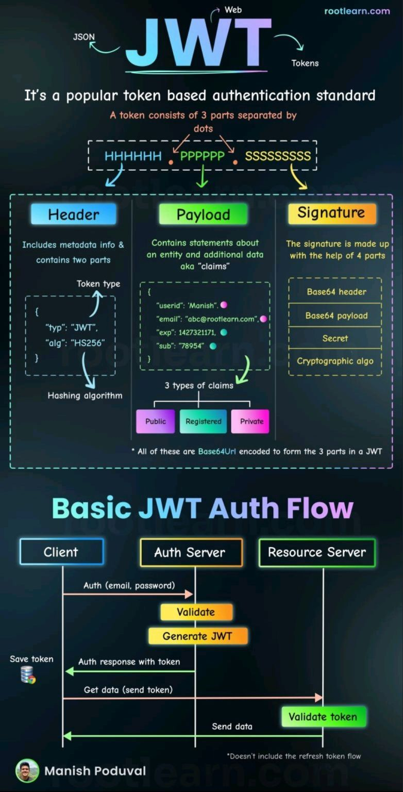
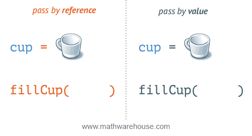
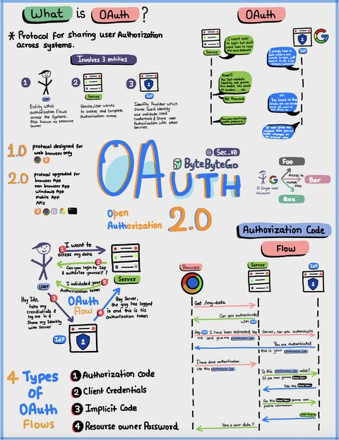

# ✅ Must-Do Theory Questions & Answers

---

#### 1. What is JWT?

JWT (JSON Web Tokens) : One of most frequently asked question in interview

Let's undertsand this

1. 𝐔𝐬𝐞𝐫 𝐀𝐮𝐭𝐡𝐞𝐧𝐭𝐢𝐜𝐚𝐭𝐢𝐨𝐧: The user provides credentials to the server (e.g., username and password). The server checks these credentials against a database or authentication service. If valid, the process continues to the next step.

2. 𝐉𝐖𝐓 𝐂𝐫𝐞𝐚𝐭𝐢𝐨𝐧 𝐚𝐧𝐝 𝐈𝐬𝐬𝐮𝐚𝐧𝐜𝐞: The server generates a JWT that contains user data in its payload. The JWT includes a header, payload, and signature for security. The server sends the token back to the client.

3. 𝐓𝐨𝐤𝐞𝐧 𝐔𝐬𝐚𝐠𝐞: The client stores the JWT securely (in local storage or cookies). For future requests to protected resources, the client includes the JWT in the "Authorization" header. This signals the server to validate the request.

4. 𝐓𝐨𝐤𝐞𝐧 𝐕𝐞𝐫𝐢𝐟𝐢𝐜𝐚𝐭𝐢𝐨𝐧: Upon receiving the JWT, the server checks its signature using a secret key. The server also verifies expiration time, audience, and other claims. If everything is valid, the server grants access.

5. 𝐒𝐭𝐚𝐭𝐞𝐥𝐞𝐬𝐬 𝐚𝐧𝐝 𝐎𝐩𝐭𝐢𝐨𝐧𝐚𝐥 𝐓𝐨𝐤𝐞𝐧 𝐑𝐞𝐟𝐫𝐞𝐬𝐡: JWTs store all necessary user data within the token, so no session data is stored on the server. If the JWT expires, the client can use a refresh token to get a new JWT without reauthentication.

#### 2. What is Pass By Value and Pass By Reference and is Java follows Pass By Reference or Pass By Value?

Think of the coffee in the cup as the data in a variable. ⚡️
One is a copy and one is the original

#### 3. What is Pass By Value and Pass By Reference 

#### 4. How is Collection different from Collections in Java?

#### 5. What is the importance of the hashCode() and equals() contract?

#### 6. Is there any difference in defining or creating a String by using a String literal and using the new() operator?

#### 7. Distinguish between String creation using the new() operator and String literal.

#### 8. Briefly discuss the Factory Design pattern.

#### 9. Is there any difference in defining or creating a String by using a String literal and using the new() operator?

#### 10. Write some important features of Java 8.

#### 11. Explain SerialVersionUID.

#### 12. How does Garbage Collection work in Java?

#### 13. How does Java handle stack and heap memory?

#### 14. What do you know about the Factory Design Pattern in Java?

#### 15. What is Oauth 2.0?
Oauth 2.0 Explained With Simple Terms. 

OAuth 2.0 is a powerful and secure framework that allows different applications to securely interact with each other on behalf of users without sharing sensitive credentials. 
 
The entities involved in OAuth are the User, the Server, and the Identity Provider (IDP). 
 
What Can an OAuth Token Do? 
 
When you use OAuth, you get an OAuth token that represents your identity and permissions. This token can do a few important things: 
 
Single Sign-On (SSO): With an OAuth token, you can log into multiple services or apps using just one login, making life easier and safer. 
 
Authorization Across Systems: The OAuth token allows you to share your authorization or access rights across various systems, so you don't have to log in separately everywhere. 
 
Accessing User Profile: Apps with an OAuth token can access certain parts of your user profile that you allow, but they won't see everything. 
 
Remember, OAuth 2.0 is all about keeping you and your data safe while making your online experiences seamless and hassle-free across different applications and services.

 