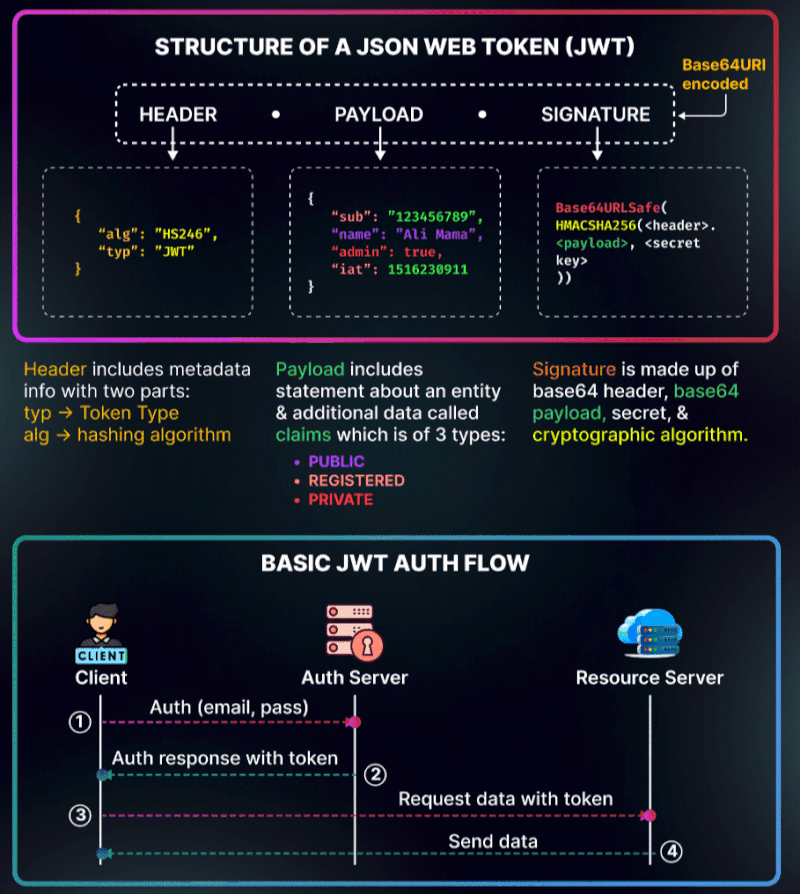

# ✅ Must-Do Theory Questions & Answers

---

#### 1. What is JWT?

JWT (JSON Web Tokens) : One of most frequently asked question in interview

Let's undertsand this

1. 𝐔𝐬𝐞𝐫 𝐀𝐮𝐭𝐡𝐞𝐧𝐭𝐢𝐜𝐚𝐭𝐢𝐨𝐧: The user provides credentials to the server (e.g., username and password). The server checks these credentials against a database or authentication service. If valid, the process continues to the next step.

2. 𝐉𝐖𝐓 𝐂𝐫𝐞𝐚𝐭𝐢𝐨𝐧 𝐚𝐧𝐝 𝐈𝐬𝐬𝐮𝐚𝐧𝐜𝐞: The server generates a JWT that contains user data in its payload. The JWT includes a header, payload, and signature for security. The server sends the token back to the client.

3. 𝐓𝐨𝐤𝐞𝐧 𝐔𝐬𝐚𝐠𝐞: The client stores the JWT securely (in local storage or cookies). For future requests to protected resources, the client includes the JWT in the "Authorization" header. This signals the server to validate the request.

4. 𝐓𝐨𝐤𝐞𝐧 𝐕𝐞𝐫𝐢𝐟𝐢𝐜𝐚𝐭𝐢𝐨𝐧: Upon receiving the JWT, the server checks its signature using a secret key. The server also verifies expiration time, audience, and other claims. If everything is valid, the server grants access.

5. 𝐒𝐭𝐚𝐭𝐞𝐥𝐞𝐬𝐬 𝐚𝐧𝐝 𝐎𝐩𝐭𝐢𝐨𝐧𝐚𝐥 𝐓𝐨𝐤𝐞𝐧 𝐑𝐞𝐟𝐫𝐞𝐬𝐡: JWTs store all necessary user data within the token, so no session data is stored on the server. If the JWT expires, the client can use a refresh token to get a new JWT without reauthentication.

**(OR)**

JSON Web Token (JWT) – A Deep Dive

JWTs are a way to securely transmit information between parties as a compact, URL-safe token. They are widely used in authentication and authorization mechanisms, especially in stateless applications like microservices.

1. Structure of a JWT

 A JWT consists of three parts, separated by dots (.):

 HEADER.PAYLOAD.SIGNATURE

a) Header

 The header contains metadata about the token, including the signing algorithm:

 {
 "alg": "HS256",
 "typ": "JWT"
 }

 • alg: Algorithm used for signing (e.g., HS256, RS256).
 • typ: Token type (always JWT).

b) Payload (Claims)

 The payload contains the actual data (claims), which can be public, private, or registered.

 {
 "sub": "1234567890",
 "name": "John Doe",
 "iat": 1700000000,
 "exp": 1700003600,
 "role": "admin"
 }

 • Registered Claims (optional but standardized):
 • iss (issuer) – Who issued the token
 • sub (subject) – User ID
 • aud (audience) – Intended recipient
 • exp (expiration) – Token expiry time
 • iat (issued at) – When the token was created
 • Custom Claims (specific to your app):
 • role: Defines user roles
 • permissions: Specifies allowed actions

c) Signature

 The signature ensures integrity, preventing tampering.

 For example, in HS256 (HMAC with SHA-256), the signature is:

 HMACSHA256(
 base64UrlEncode(header) + "." + base64UrlEncode(payload), 
 secret
 )

 For RS256 (RSA), a private key is used to sign, and a public key is used to verify.

2. How JWT Authentication Works
 1. User Logs In
 • The user provides credentials (e.g., username & password).
 2. Server Generates a JWT
 • If credentials are valid, the server signs a JWT and sends it to the client.
 3. Client Stores the Token
 • The token is stored securely (in memory or HTTP-only cookies).
 4. Client Sends JWT with Requests
 • The client includes the token in the Authorization header:

 Authorization: Bearer <JWT>

 5. Server Verifies the JWT
 • The server checks the signature and expiration.
 • If valid, it processes the request; otherwise, it rejects it.

3. Why Use JWTs?

 ✅ Stateless Authentication – No need for session storage on the server.
 ✅ Compact & Fast – Easy to transmit in headers.
 ✅ Cross-Domain Support – Works well for APIs & microservices.

4. Best Practices for Using JWTs
 • Use HTTPS – Prevent token interception.
 • Short Expiry Times – Reduce risk of token misuse.
 • Use Refresh Tokens – Issue short-lived JWTs and refresh them securely.
 • Don’t Store JWTs in Local Storage – Prefer HTTP-only cookies.
 • Validate Tokens – Always verify signatures and claims on the backend.

5. Code Example (Node.js & Express)

Generating a JWT (Using jsonwebtoken)

 const jwt = require('jsonwebtoken');

 const user = { id: 1, name: 'John Doe', role: 'admin' };
 const secret = 'supersecretkey';
 const token = jwt.sign(user, secret, { expiresIn: '1h' });

 console.log('JWT:', token);

 

#### 2. What is Pass By Value and Pass By Reference and is Java follows Pass By Reference or Pass By Value?

Think of the coffee in the cup as the data in a variable. ⚡️
One is a copy and one is the original

#### 3. What is Pass By Value and Pass By Reference 

#### 4. How is Collection different from Collections in Java?

#### 5. What is the importance of the hashCode() and equals() contract?

#### 6. Is there any difference in defining or creating a String by using a String literal and using the new() operator?

#### 7. Distinguish between String creation using the new() operator and String literal.

#### 8. Briefly discuss the Factory Design pattern.

#### 9. Is there any difference in defining or creating a String by using a String literal and using the new() operator?

#### 10. Write some important features of Java 8.

#### 11. Explain SerialVersionUID.

#### 12. How does Garbage Collection work in Java?

#### 13. How does Java handle stack and heap memory?

#### 14. What do you know about the Factory Design Pattern in Java?

#### 15. What is Oauth 2.0?
Oauth 2.0 Explained With Simple Terms. 

OAuth 2.0 is a powerful and secure framework that allows different applications to securely interact with each other on behalf of users without sharing sensitive credentials. 
 
The entities involved in OAuth are the User, the Server, and the Identity Provider (IDP). 
 
What Can an OAuth Token Do? 
 
When you use OAuth, you get an OAuth token that represents your identity and permissions. This token can do a few important things: 
 
Single Sign-On (SSO): With an OAuth token, you can log into multiple services or apps using just one login, making life easier and safer. 
 
Authorization Across Systems: The OAuth token allows you to share your authorization or access rights across various systems, so you don't have to log in separately everywhere. 
 
Accessing User Profile: Apps with an OAuth token can access certain parts of your user profile that you allow, but they won't see everything. 
 
Remember, OAuth 2.0 is all about keeping you and your data safe while making your online experiences seamless and hassle-free across different applications and services.

 
#### 16. What are the advantages of using Spring Boot?  
#### 17. What are the Spring Boot key components?  
#### 18. Why Spring Boot over Spring?  
#### 19. What is the starter dependency of the Spring boot module?  
#### 20. How does Spring Boot works?  
#### 21. What does the @SpringBootApplication annotation do internally?  
#### 22. What is the purpose of using @ComponentScan in the class files?  
#### 23. How does a Spring Boot application get started?  
#### 24. What are starter dependencies?  
#### 25. What is Spring Initializer?  
#### 26. What is Spring Boot CLI and what are its benefits?  
#### 27. What are the most common Spring Boot CLI commands?  
#### 28. What Are the Basic Annotations that Spring Boot Offers?  
#### 29. What is Spring Boot dependency management?  
#### 30. Can we create a non-web application in Spring Boot?  
#### 31. Is it possible to change the port of the embedded Tomcat server in Spring Boot?  
#### 32. What is the default port of Tomcat in Spring Boot?  
#### 33. Can we override or replace the Embedded Tomcat server in Spring Boot?  
#### 34. Can we disable the default web server in the Spring Boot application?  
#### 35. How to disable a specific auto-configuration class?  
#### 36. Explain @RestController annotation in Spring Boot?  
#### 37. What is the difference between @RestController and @Controller in Spring Boot?  
#### 38. Describe the flow of HTTPS requests through the Spring Boot application?  
#### 39. What is the difference between RequestMapping and GetMapping?  
#### 40. What is the use of Profiles in Spring Boot?  
#### 41. What is Spring Actuator? What are its advantages?  
#### 42. How to enable Actuator in Spring Boot application?  
#### 43. What are the actuator-provided endpoints used for monitoring the Spring Boot application?  
#### 44. How to get the list of all the beans in your Spring Boot application?  
#### 45. How to check the environment properties in your Spring Boot application?  
#### 46. How to enable debugging log in the Spring Boot application?  
#### 47. Where do we define properties in the Spring Boot application?  
#### 48. What is Dependency Injection?  
#### 49. What is an IOC container?
#### 50. What is CORS? Why Does It Happen? ? The Real Problem Behind CORS ? How Do You Fix It? Can We Bypass CORS? 
What is CORS? 
CORS stands for Cross-Origin Resource Sharing—a security feature built into browsers. 

It blocks requests made from one origin (domain, protocol, or port) to another origin unless explicitly allowed by the server. 

For example: 
- Your frontend is hosted at `frontend.com`. 
- Your backend API is hosted at `api.backend.com`. 

The browser treats these as different origins and blocks the request unless it’s explicitly allowed. 

 2/ Why Does It Happen? 
CORS errors are triggered by the Same-Origin Policy, which prevents malicious websites from making unauthorized API calls using your credentials. 

When the backend server doesn’t include the right CORS headers, the browser refuses to share the response and throws this error: 

> *Access to fetch at 'https://api.backend.com' from origin 'https://frontend.com' has been blocked by CORS policy: No 'Access-Control-Allow-Origin' header is present.* 

In short, the browser isn’t blocking the request—it’s blocking the response for security reasons. 

 3/ The Real Problem Behind CORS 
- It’s not a frontend issue. 
- It’s not a browser bug. 
- It’s a server-side configuration issue. 

Most candidates panic and assume the browser is the problem. It’s not. 

CORS is the server’s responsibility to allow or deny requests from other origins. 

 4/ How Do You Fix It? 

Step 1: Update the Backend. 
The server must send the right headers, like: 
- `Access-Control-Allow-Origin: *` (Allows all origins). 
- Or specify trusted domains like `Access-Control-Allow-Origin: https://frontend.com`. 

Step 2: Handle Preflight Requests (OPTIONS). 
For complex requests (like `POST` with custom headers), browsers send a preflight request before the actual call. 

The server must respond to this with: 
- `Access-Control-Allow-Methods: GET, POST, OPTIONS` 
- `Access-Control-Allow-Headers: Content-Type, Authorization` 

Step 3: Use a Proxy for Local Development. 
If the backend isn’t updated yet, set up a proxy to forward requests through the same origin as your frontend. 

 5/ Can We Bypass CORS? 
Short answer—No. 

Any hacky workaround, like disabling CORS in the browser or using extensions, won’t work in production. 

Fix it properly by configuring the server. That’s the only scalable solution. 

 6/ Why Is This Important in Interviews? 
Because CORS tests whether you: 
- Understand how the web works. 
- Can debug issues logically. 
- Know where the real problem lies (backend vs frontend).

